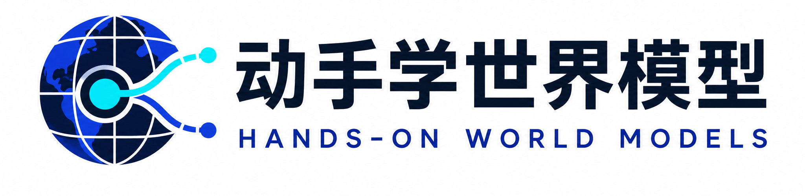

<div align="center">
  

  <p>
    <strong>机器看见的只是一帧画面，世界模型学会的是整个世界如何运转。</strong><br />
    从连续观察中推测看不见的状态，学习时间、行动会让世界怎样变化——然后，在想象中规划未来。
  </p>

  <p>
    <a href="https://img.shields.io/badge/License-CC%20BY--NC--SA%204.0-lightgrey.svg"></a>
    <a href="https://walkinglabs.github.io/hands-on-world-models/"></a>
    <a href="https://github.com/walkinglabs/hands-on-world-models/issues"></a>
  </p>

  <p>
    <a href="https://walkinglabs.github.io/hands-on-world-models/guide/world-model-intro.html"><strong>📖 开始阅读</strong></a> ·
    <a href="#全书结构">🗂️ 查看目录</a> ·
    <a href="#实验代码">🧪 运行实验</a> ·
    <a href="#快速开始">🚀 快速开始</a> ·
    <a href="#读者交流群微信">💬 读者交流群</a>
  </p>
</div>

> [!CAUTION]
> **课程正在集中重写，内容仍在快速演进。** 章节与实验可能发生较大变化，建议在 **2026 年 8 月 24 日之后**再开始系统学习。在此之前，欢迎浏览结构、提出建议。

## ✨ 本书特色

<table>
  <tr>
    <td width="50%" align="center">
      
      <br />
      <strong>亲手训练自己的世界模型</strong>
      <br />
      <sub>从一个可以逐格检查的九宫格世界出发，每一步只引入一个新问题：图像、记忆、预测、规划。</sub>
    </td>
    <td width="50%" align="center">
      
      <br />
      <strong>公式旁边就是代码</strong>
      <br />
      <sub>每学一个公式，就在 Notebook 里找到对应的 PyTorch 实现——运行它、修改它、观察模型如何变化。</sub>
    </td>
  </tr>
  <tr>
    <td width="50%" align="center">
      
      <br />
      <strong>五条路线，任选一条走通</strong>
      <br />
      <sub>共同基础完成后，从空间、视频、决策、JEPA、机器人中选择一条路线，完整训练并检验一个小模型。</sub>
    </td>
    <td width="50%" align="center">
      
      <br />
      <strong>19 份实验，全部可以直接运行</strong>
      <br />
      <sub>从基础实验一路排到路线收尾，每份 Notebook 只解决一个问题，开箱即跑。</sub>
    </td>
  </tr>
  <tr>
    <td width="50%" align="center">
      
      <br />
      <strong>系统学习模型评价</strong>
      <br />
      <sub>从单步误差到多步预测、动作响应与陌生场景测试，讲清楚每一种检查能回答什么问题。</sub>
    </td>
    <td width="50%" align="center">
      
      <br />
      <strong>从复现经典走向独立研究</strong>
      <br />
      <sub>复现经典方法、分析一次稳定的失败、完成对照实验，最终提出你自己的模型改进。</sub>
    </td>
  </tr>
</table>

## 目录

- [本书特色](#本书特色)
- [本书介绍](#本书介绍)
- [最新动态](#-最新动态-news)
- [演进路线图](#️-演进路线图-roadmap)
- [全书结构](#全书结构)
- [实验代码](#实验代码)
- [推荐学习路径](#推荐学习路径)
- [快速开始](#快速开始)
- [参与贡献](#参与贡献)
- [其他课程](#其他课程)
- [引用](#引用)
- [致谢](#致谢)
- [开源协议](#开源协议)

## 📖 本书介绍

世界模型首先要解决的是**观察问题**。机器看见的只是一张图片、一段声音或某个相机视角，真实世界却在观察之外继续存在：物体会被遮挡，速度藏在前后帧的变化里，换一个视角，同一张桌子也不该变成另一个世界。世界模型尝试从连续观察中构建一个内部世界——记住暂时看不见的状态，并学习这个世界如何随时间演化。

**动作**随后加入。如果数据中记录了按键、方向盘或机器人关节指令，模型就能进一步学习"做了这个动作，世界会怎样改变"。规划器可以用这些预测比较不同做法，策略也可以从比较结果中学习。当然，预测动作的后果只是世界模型的一种用途，而非它的全部定义。

**《动手学世界模型》**先分清观察、状态与变化，再在浏览器里体验一台会「猜下一步」的模型。手写九格转移表放到第 3 章；随后逐步引入图像、历史、遮挡、不确定性和三维空间——CNN、ViT、GRU、Transformer、VAE、RSSM 等组件在对应问题出现时进入实现；CEM、MCTS 与 Actor-Critic 等到真正需要选择动作时再加入。

完成共同基础后，课程分为五条路线：

| 路线            | 核心问题                               |
| :-------------- | :------------------------------------- |
| 🌌 空间世界     | 如何跨视角保持三维结构？               |
| 🎮 互动视频     | 如何生成连续、真正听从动作的画面？     |
| 🧠 决策与规划   | 如何用内部模拟减少现实中的试错？       |
| 🔮 JEPA         | 哪些未来信息值得保留？                 |
| 🤖 VLA 与机器人 | 如何把观察、语言、动作和后果接成闭环？ |

五条路线形式各异，但都回答同三个问题：**机器观察到了什么，内部保留了什么，学到的变化规律经得起哪些检查。**

### 如何讲解

每章遵循"**问题 → 方法 → 实验 → 反思**"的节奏：一个具体任务先暴露困难，再引入解决困难所需的概念与公式；可运行代码、训练曲线和评测指标用来检验方法；章节最后交代方法的假设、失败情形与适用范围。

代码尽量保留算法的主数据流：轨迹如何采集、观察如何编码、历史状态如何更新、动作如何进入 dynamics、模型如何生成 rollout、planner 或 policy 如何使用预测结果。工程技巧在真正需要时引入，不单独堆成术语表。

### 适合谁读

本书面向希望**系统学习世界模型**的学生、研究者与工程师。你只需要具备基础 Python 能力、能读懂简单的 PyTorch 代码；必要的向量、概率与梯度知识会在用到时现场复习，不要求你先修完一整套数学或强化学习课程。

读完共同基础与一条路线后，你将能够：

- 说清楚一个世界模型的输入、输出和使用方式；
- 解释 CNN、ViT、GRU、RSSM、VAE、VQ-VAE、Diffusion、MPC、CEM、MCTS 在系统中的位置；
- 从零实现一个小型 dynamics model，并检查 shape、梯度、一步预测与多步 rollout；
- 区分 Dreamer、MuZero、互动视频、JEPA、VLA 与空间世界模型的训练目标；
- 为连续轨迹设计数据切分、训练目标、反事实测试与下游评价；
- 根据失败样例提出改动，并用受控实验比较结果。

### 当前状态

本仓库是一个持续建设的中文开源课件，追求三件事：**概念正确、代码可运行、实验状态透明**。

- 课程正文：[`docs/chapters/`](docs/chapters/)
- 教学 Notebook：[`notebooks/`](notebooks/)
- 运行证据规范：[`docs/run-evidence.md`](docs/run-evidence.md)
- 本地验证：`npm run verify`
- 开源协议：[CC BY-NC-SA 4.0](LICENSE)

所有 Notebook 已纳入自动 smoke 测试；共同基础到决策与规划路线已打通一条可解释的 PixelWorld 闭环——从图片测量状态、学习动态、在模型中规划，再与真实环境的随机动作对照。尚未提交各章最后一份动手要求的 24GB 完整训练记录，外部数据的 loader、切分与校验值正在逐项补齐（详见[演进路线图](#️-演进路线图-roadmap)）。

> [!NOTE]
> **需要帮助？** 课程正在征集单张 24GB 显卡上的完整训练记录、失败样例与外部小数据 loader。提交时请附上环境、随机种子、曲线与 checkpoint 信息，规范见 [`docs/run-evidence.md`](docs/run-evidence.md)。

## 🔥 最新动态 (News)

- **[2026-08-13]** 🎉 发布课程初版，并确定九章、67 个正文 Page、三个附录的重构总纲。

> [!NOTE]
> 本课程有 AI 协助整理，目前尚未完成全面人工审稿，可能存在事实错误、解释不清或代码边界未覆盖的情况。欢迎通过 Issue 与 Pull Request 指正——每一条都会被认真处理。

## 🗺️ 演进路线图 (Roadmap)

课程处于活跃开发中，当前计划如下：

- [x] 确定九个大章、67 个正文 Page、三个附录与五条选修路线
- [x] 发布 1.6–3.4、路线 Notebook、各章动手页与统一评价
- [x] 将 Notebook 代码格纳入自动 smoke 测试
- [x] 建立数据状态与运行证据格式
- [ ] 完成首批完整训练的单张 24GB 结果与 checkpoint
- [ ] 完成外部 T2 数据的固定 loader、切分与 SHA256 校验
- [ ] 补充各路线的失败样例与同预算对照实验
- [ ] 发布第一版稳定课程网站与 PDF

## 🗂️ 全书结构

全书共四部分、九个大章。每个大章有一页导读，下面再分成若干可独立阅读的小章：第一部分用小环境建立世界模型的基本问题；第二部分接上常用组件、数据与第一台可学习模型；第三部分提供五条可独立选择的路线；第四部分讨论评测与研究设计。

最终规模为 **9 章、57 个正文 Page、4 个附录**。学生的实际学习路径约为：共同基础 17 页、一条设计路线 6–8 页、评测与研究设计 4 页。外来课的主题全部落入正文对应节或附录 D，不另开第 10 章。

完整课程总纲见 [`docs/课程总纲.md`](docs/课程总纲.md)。下面展开全部 57 个正文 Page，不用章节代号或实验代号代替知识内容。

### 第一部分：引言

课程先分清观察、状态与变化，再在浏览器里体验一台会「猜下一步」的世界模型。手写九格转移表放到第 3 章；训一台会做梦的赛车放到第 4 章。

#### [第 1 章　为什么需要世界模型](docs/chapters/01-why-world-models/01-observation-and-state.md)

**核心问题：什么才算世界模型，它与预测、生成、规划和策略是什么关系？**

1. **1.1 观察、状态与变化**
2. **1.2 什么是世界模型**
3. **1.3 经典世界模型**
4. **1.4 动手：在想象中驾驶**：纯体验，不写代码，用震撼的 Demo 勾起读者的兴趣。

### 第二部分：共同基础

这一部分只保留后续所有路线都会复用的组件，并把每个组件放回它要解决的问题中。

#### [第 2 章　预备知识](docs/chapters/02-foundations/01-tensors-and-trajectories.md)

**核心问题：造一台世界模型之前，需要掌握哪些最少但可复用的组件？**

1. **2.1 张量与轨迹**：读懂批次、时间、通道与空间维度，正确对齐观察和动作。
2. **2.2 卷积神经网络与视觉 Transformer**：比较卷积网络与视觉 Transformer 的表示方式。
3. **2.3 循环神经网络与注意力机制**：从 RNN、GRU、Transformer 走到确定性与随机隐状态。
4. **2.4 变分自编码器与向量量化**：理解 VAE、VQ-VAE、离散 token 与扩散模型的基本接口。
5. **2.5 坐标系与三维表示**：认识相机、点云、鸟瞰图和占用网格。
6. **2.6 价值函数与策略梯度**：理解价值、策略、规划器怎样使用模型预测。
7. **2.7 动手：核心组件的简洁实现**：用小实验检查视觉、记忆、压缩、空间和规划接口。

#### [第 3 章　数据与第一个世界模型](docs/chapters/03-data-and-first-model/01-episodes-and-transitions.md)

**核心问题：怎样把经历变成训练数据，并证明第一台模型确实学到了动力学？**

1. **3.1 经历与状态转移**：定义 episode、transition、终止状态和时间对齐。
2. **3.2 经验回放池**：按 episode 切分数据，避免相邻帧与未来信息泄漏。
3. **3.3 转移概率与极大似然估计**：从计数模型理解 \(p(s_{t+1}\mid s_t,a_t)\)。
4. **3.4 多步预测与累积误差**：比较弱基线、多步漂移、反事实动作、未见组合与规划增益。
5. **3.5 动手：表格型世界模型的从零开始实现**：从轨迹学习转移表，再用模型预测控制完成任务。
6. **3.6 动手：神经网络世界模型的简洁实现**：换一张地图，自己留一个缺口，让一种失败稳定出现。

### 第三部分：五种设计路线

完成第 1–3 章后，从第 4–8 章选择一条深入。五条路线彼此并列；第 4 章是推荐入口，不是其余路线的先修课。

#### [第 4 章　决策与规划](docs/chapters/04-decision-and-planning/01-latent-world-model.md)

**核心问题：怎样在潜在状态中推演未来，并把想象变成动作？**

1. **4.1 潜在动力学模型**：把高维观察压缩成适合预测和决策的状态。
2. **4.2 循环状态空间模型**：用确定性记忆和随机状态表达历史与不确定性。
3. **4.3 交叉熵方法与模型预测控制**：用 CEM、PlaNet 与 TD-MPC2 比较候选动作序列。
4. **4.4 想象训练**：在 latent rollout 中训练价值函数和策略。
5. **4.5 蒙特卡洛树搜索**：只学习搜索所需的表示、奖励、价值与策略。
6. **4.6 动手：循环状态空间模型的从零开始实现**：复现 VAE、MDN-RNN 与小控制器组成的经典系统。
7. **4.7 动手：想象训练的简洁实现**：训练 RSSM，并在想象轨迹中更新 Actor-Critic。

#### [第 5 章　交互式视频](docs/chapters/05-interactive-video/01-video-data.md)

**核心问题：怎样生成受动作控制、能够长时交互而不持续漂移的视频世界？**

1. **5.1 自回归视频生成**：区分被动视频生成与动作条件世界模型。
2. **5.2 图像与视频词元化**：比较像素、连续 latent、离散 token 和特征目标。
3. **5.3 动作条件注入**：理解序列建模、扩散生成和 Diffusion Forcing 的分工。
4. **5.4 键值缓存与实时生成**：讨论长时一致性、重访一致性、KV 缓存、蒸馏和延迟。
5. **5.5 动手：交互式视频模型的从零开始实现**：训练 token 预测器，并检查自由 rollout 与反事实动作。
6. **5.6 动手：受动作控制的视频小世界**：把 tokenizer 训到能辨认物体，并证明画面真的听从按键。

#### [第 6 章　联合嵌入预测架构](docs/chapters/06-jepa/01-feature-prediction.md)

**核心问题：什么时候应预测抽象特征而不是像素，又怎样避免表示坍缩？**

1. **6.1 联合嵌入与特征预测**：理解不重建像素的预测目标。
2. **6.2 掩码机制与表示坍缩**：学习上下文编码器、目标编码器和防坍缩机制。
3. **6.3 目标网络**：从图像掩码扩展到时空块和视频表征。
4. **6.4 动作条件特征预测**：让特征预测响应动作，并服务短视野规划。
5. **6.5 动手：联合嵌入预测架构的从零开始实现**：训练 Tiny Video-JEPA，用探针和反事实动作检查表征。
6. **6.6 动手：视频 JEPA 的简洁实现**：排查表示坍缩，用探针证明特征里留下了位置与运动。

#### [第 7 章　具身智能与机器人](docs/chapters/07-robot-vla/01-robot-interfaces.md)

**核心问题：世界模型怎样进入机器人的数据、策略、分层控制和 Sim-to-Real 闭环？**

1. **7.1 机器人数据与异构观测**：统一描述本体、观察、动作、控制频率、URDF/MJCF/USD 与数据格式。
2. **7.2 行为克隆与扩散策略**：解释行为克隆漂移、动作多模态、动作分块、扩散/流匹配与 RTC。
3. **7.3 视觉语言动作模型**：比较视觉编码器、语言条件、动作专家与生成头。
4. **7.4 接触力与全身控制**：连接机械臂、灵巧手、滑移预测、接触稳定性与高频控制。
5. **7.5 模拟器与现实迁移**：使用 Isaac Lab、MuJoCo、ManiSkill、域随机化、蒸馏和系统辨识。
6. **7.6 动手：扩散策略的从零开始实现**：训练小型 VLA，并在执行前比较候选动作后果。
7. **7.7 动手：现实迁移的简洁实现**：从抓取到插接，检查视觉、摩擦、延迟和接触差异。
8. **7.8 动手：把世界模型接上身体**：融合视觉、关节与触觉信息，预测滑移和接触稳定性。

#### [第 8 章　空间世界与自动驾驶](docs/chapters/08-spatial-worlds/01-camera-geometry.md)

**核心问题：怎样表示、重建并预测持续变化的三维世界？**

1. **8.1 相机模型与多视角投影**：从内参、外参与深度恢复三维点。
2. **8.2 鸟瞰图与三维占用网格**：把多相机观察变成统一空间表示。
3. **8.3 神经辐射场与三维高斯**：比较 NeRF、3DGS 与显式几何。
4. **8.4 时空四维场景预测**：让三维表示随时间、对象和动作变化。
5. **8.5 自动驾驶世界模型**：预测未来视频、鸟瞰图与占用，并服务闭环驾驶。
6. **8.6 动手：占用网格预测的从零开始实现**：完成相机反投影、动态场与 future occupancy 实验。
7. **8.7 动手：驾驶场景下的四维世界模型**：在四维神经场与驾驶未来占用之间选一条，写清结论的边界。

### 第四部分：评测与研究设计

最后把各条路线放回统一问题：模型是否真的响应动作、能否稳定推演，以及它是否改善下游任务。

#### [第 9 章　评测与研究设计](docs/chapters/09-evaluate-and-invent/01-perception-and-utility.md)

**核心问题：怎样判断模型真正有用，并把一次失效转化为可检验的研究问题？**

1. **9.1 感知质量与任务效用**：区分“看起来真实”与“足以支持决策”。
2. **9.2 动手：世界模型的系统评测**：完成多步、反事实、分布外、校准与规划器漏洞测试。
3. **9.3 动手：失效分析与模型改进**：把稳定失效变成竞争假设、最小改动与可证伪实验。
4. **9.4 动手：设计新的世界模型**：固定一个稳定失效，只改一件事，设计能证明自己错的实验。

### 附录：随学随查的工具箱

#### [附录 A　数学底座与术语速查](docs/appendices/math-code-glossary.md)

概率与期望、梯度与链式法则、KL 与熵、常用 PyTorch 片段、PyTorch–JAX/Flax 接口和中英文术语。

#### [附录 B　数据集、算力与交付标准](docs/appendices/data-compute-delivery.md)

数据切分与泄漏检查、数据可用状态、smoke/course/research 算力配置、实验复现字段和课程交付规范。

#### [附录 C　经典文献与产业地图](docs/appendices/papers-benchmarks-industry.md)

四问论文阅读法、五条研究路线、评测基准、中美产业路线，以及代码、权重、数据的开放状态。

#### [附录 D　相关领域对照](docs/appendices/neighboring-fields.md)

无模型强化学习（Model-free RL）、离线强化学习（Offline RL）、分层规划，以及多智能体世界模型（Multi-Agent World Models）对照。

## 🧪 实验代码

[`notebooks/`](notebooks/) 目录包含与章节一一对应的可运行实验。每条路线配备两到三份 Notebook，方便独立阅读、运行与修改。

| 领域         | 代码路径                                                             | 代表性实验                                            |
| :----------- | :------------------------------------------------------------------- | :---------------------------------------------------- |
| 世界模型入门 | [`notebooks/01_reinvent/`](notebooks/01_reinvent/)                   | 在九格世界中实现 transition、rollout 与 planner。     |
| 共同组件     | [`notebooks/02_foundations/`](notebooks/02_foundations/)             | 检查 CNN、GRU、压缩、空间与规划组件。                 |
| 数据与小模型 | [`notebooks/03_data/`](notebooks/03_data/)                           | 整理连续经历，并学出一台表格 dynamics。               |
| 决策与规划   | [`notebooks/04_decision/`](notebooks/04_decision/)                   | 学习 latent dynamics，并在想象轨迹中训练动作选择。    |
| 可交互视频   | [`notebooks/05_interactive_video/`](notebooks/05_interactive_video/) | 压缩 PixelWorld 画面，训练动作条件多步预测。          |
| JEPA         | [`notebooks/06_jepa/`](notebooks/06_jepa/)                           | 训练特征预测器，检查表示坍缩与动作敏感性。            |
| VLA 与机器人 | [`notebooks/07_robot/`](notebooks/07_robot/)                         | 从行为克隆起步，再用后果模型比较候选动作。            |
| 空间与驾驶   | [`notebooks/08_spatial/`](notebooks/08_spatial/)                     | 建立相机与空间表示，预测 4D 场景或 future occupancy。 |
| 统一评价     | [`notebooks/09_evaluation/`](notebooks/09_evaluation/)               | 比较多步误差、反事实动作、OOD 与规划增益。            |
| 提交模板     | [`notebooks/projects/`](notebooks/projects/)                         | 3.6、各路线最后一份动手与 9.4 的提交骨架。            |

完整文件索引与依赖说明见 [`notebooks/README.md`](notebooks/README.md)。

## 🎯 推荐学习路径

**第一次系统学习**：按顺序完成第 1–3 章与3.6 动手：重新发明一台可学习世界模型。第 1 章提出问题，第 2 章认识组件，第 3 章把连续经历整理成数据、学出第一台模型。

**然后选择一条路线**：决策与规划、互动视频、JEPA、VLA 与机器人、空间世界——选哪一条取决于你想让模型输出什么，而不取决于侧栏里的先后位置。走完所选路线的全部动手页后，再进入第 9 章。

每章建议完成四件事：**说明本章要解决的问题；画出模型的输入与输出；运行至少一个实验；改变一个条件并解释结果。** 数学或工程细节可在需要时查阅附录，不必先顺序读完。

## 🚀 快速开始

### 在线阅读

课程正文可以直接在 GitHub 中阅读：

```text
https://github.com/walkinglabs/hands-on-world-models/tree/main/docs/chapters
```

### 本地运行文档网站

环境要求：Node.js >= 18.0.0 与 npm。

```bash
git clone https://github.com/walkinglabs/hands-on-world-models.git
cd hands-on-world-models
npm install
npm run dev
```

然后在浏览器中打开终端显示的 VitePress 地址（通常是 `http://localhost:5173`）。

修改正文、导航、主题或构建脚本后，运行 `npm run verify` 检查格式并构建静态网站。

### 运行课程代码

创建 Python 环境并安装 Notebook 与神经网络依赖：

```bash
python3 -m venv .venv
source .venv/bin/activate
python -m pip install -e '.[neural,notebook]'
python -m unittest discover -s tests -v
```

从第一份 Notebook 开始：

```bash
jupyter lab notebooks/01_reinvent/invent-a-world-model.ipynb
```

查看并生成项目内数据：

```bash
hwm-data list
hwm-data generate pixelworld --seed 0 --num-samples 12
```

各路线的额外依赖与数据状态见 [`notebooks/README.md`](notebooks/README.md)。

## 仓库结构

```text
hands-on-world-models/
├── docs/                      # VitePress 课程正文与课程资料
│   ├── .vitepress/            # 网站配置和导航
│   ├── chapters/              # 9 个大章目录与正式小章
│   └── public/                # 网站与 README 静态资源
├── notebooks/                 # 共同基础、五条路线、评价与提交模板
├── src/hwm/                   # 环境、数据生成器和教学模型组件
├── data/                      # 数据 registry 与本地生成数据
├── tests/                     # 代码与 Notebook smoke 测试
├── package.json               # 文档网站命令与依赖
├── pyproject.toml             # Python 包、CLI 与可选依赖
├── CONTRIBUTING.md            # 贡献指南
└── README.md                  # 项目总览
```

## 开发命令

```bash
npm run dev           # 启动本地文档服务器
npm run build         # 构建静态网站
npm run preview       # 预览构建结果
npm run format        # 使用 Prettier 格式化仓库
npm run format:check  # 检查格式
npm run verify        # 检查格式并构建网站
```

```bash
PYTHONPATH=src python3 -m unittest discover -s tests -v  # 运行 Python 与 Notebook 测试
hwm-data list                                            # 查看数据状态
hwm-data generate pixelworld --seed 0                    # 生成项目内小数据
```

## 🤝 参与贡献

让课程**更清楚、更准确、更容易复现、更容易使用**的改动，都是好贡献：

- 修复概念错误、公式、图表、失效链接或错别字；
- 改进已有章节的解释与例子；
- 添加用于说明现有方法的小型可复现实验；
- 补充数据 loader、固定切分、checksum 与许可信息；
- 提交单张 24GB 显卡上的完整运行日志、曲线与 checkpoint；
- 改进测试、构建脚本、导航与可访问性；
- 补充论文、官方文档与开源实现的原始出处。

请保持 Pull Request 范围明确：一个 PR 通常只处理一个章节、一个实验、一条数据链或一个基础设施问题。

添加内容时：

1. 将课程正文放在 [`docs/`](docs/) 目录；
2. 将可运行实验放在 [`notebooks/`](notebooks/) 或 [`src/hwm/`](src/hwm/)；
3. 为实验提供数据来源、随机种子、输入输出 shape 与最小 smoke；
4. 添加可导航页面时更新 VitePress 配置；
5. 提交前运行 `npm run verify` 与 Python 测试；
6. 使用 Conventional Commits，例如 `docs: clarify rssm state` 或 `fix: align action timestamps`。

详细规范见 [`CONTRIBUTING.md`](CONTRIBUTING.md)。

## 📚 其他课程

WalkingLabs 还制作了以下开源课程：

- [**Hands-On Modern RL**](https://github.com/walkinglabs/hands-on-modern-rl) — 从经典序贯决策与策略优化，进入大模型后训练、Agentic RL 与多模态系统。
- [**Modern LLM Notebook**](https://github.com/walkinglabs/modern-llm-notebook) — 使用 Jupyter Notebook 从零实现 Tokenizer、Transformer、训练、推理与对齐。

## 💬 读者交流群（微信）

有任何建议或反馈，欢迎扫码加入读者交流群：


## 引用

如果在教学材料、学习笔记或衍生的非商业教育作品中使用本课程，请引用本仓库：

```bibtex
@misc{hands_on_world_models,
  title        = {Hands-On World Models: From First Principles to Prediction, Planning, and Action},
  author       = {WalkingLabs},
  year         = {2026},
  howpublished = {\url{https://github.com/walkinglabs/hands-on-world-models}},
  note         = {Chinese open courseware repository}
}
```

## 致谢

本课程的组织方式参考了 [Hands-On Modern RL](https://github.com/walkinglabs/hands-on-modern-rl)、[《动手学深度学习》](https://zh.d2l.ai/)、[Stanford CS336](https://stanford-cs336.github.io/spring2025/) 与[南京大学计算机系统基础课程实验](https://nju-projectn.github.io/ics-pa-gitbook/ics2024/)。

课程内容参考了 World Models、PlaNet、Dreamer、MuZero、IRIS、DIAMOND、V-JEPA、VLA、NeRF、3D Gaussian Splatting、BEV 与 Occupancy 等研究及开源实现，具体论文与代码来源列在相应章节中。

感谢每一位论文作者、开源实现维护者、课程试读者与贡献者。

## 开源协议

本课程资料采用 [CC BY-NC-SA 4.0](LICENSE)（署名-非商业性使用-相同方式共享 4.0 国际）协议发布：你可以出于非商业目的共享与修改本材料，前提是给出适当署名，并让衍生作品继续使用相同协议。

---

<div align="center">
  <p>如果这门课程对你有帮助，欢迎点一颗 Star ⭐️——这是对我们最大的鼓励。</p>
  <sub>Maintained with ❤️ by WalkingLabs & Contributors.</sub>
</div>
