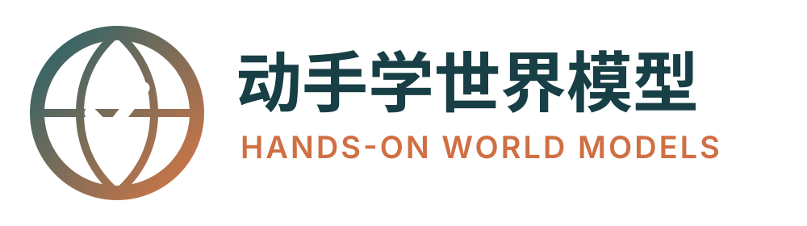
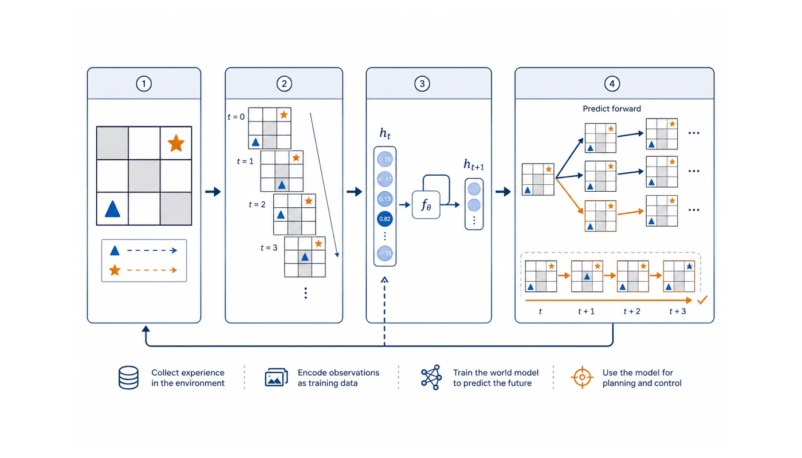
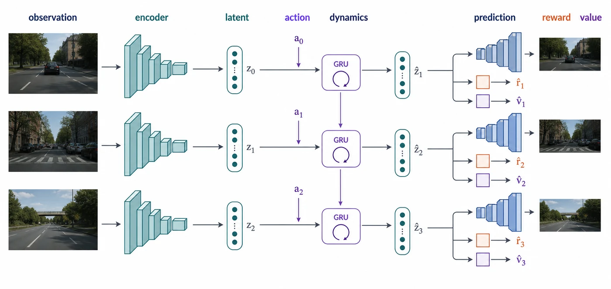
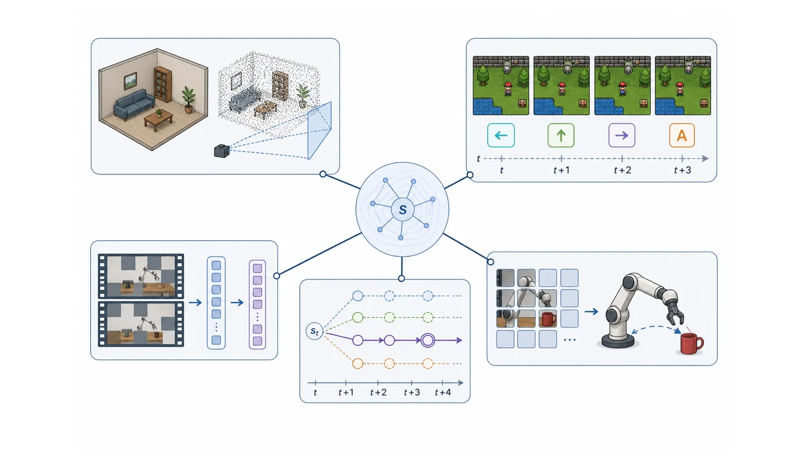
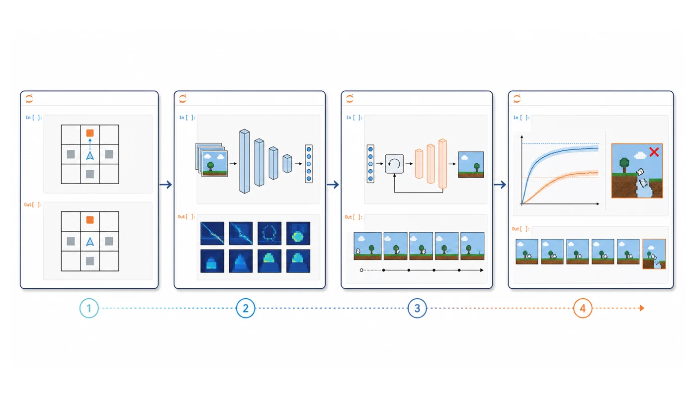
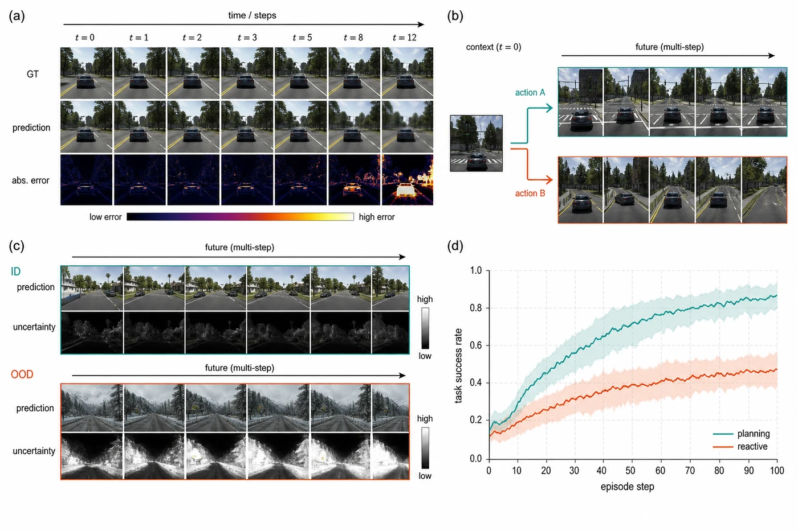
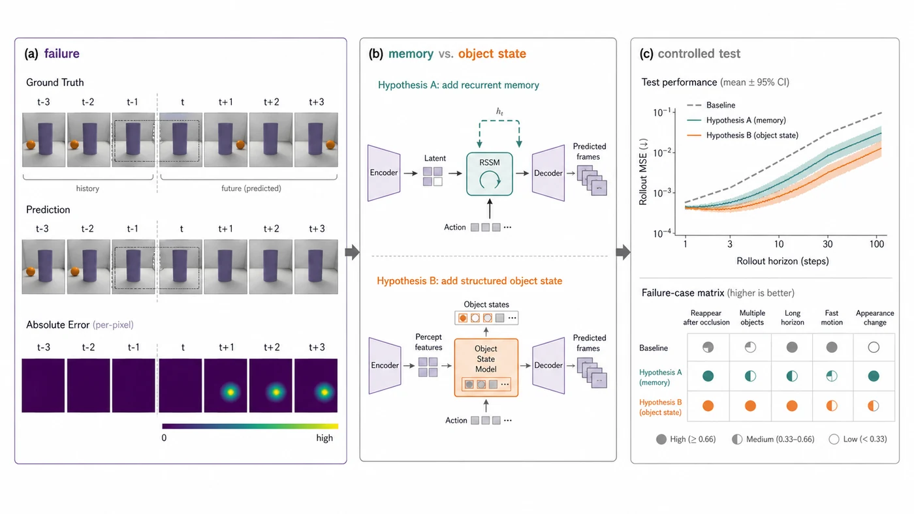

<div align="center">
  
  <p><em>从一次“先想再做”的需要出发，亲手搭起能看、能记、能预测、能规划的小世界</em></p>

  <p>
    <a href="https://github.com/walkinglabs/hands-on-world-models/actions/workflows/test.yml"></a>
    <a href="https://github.com/walkinglabs/hands-on-world-models/blob/main/LICENSE"></a>
    = 3.9" />
    = 18" />
    
    
  </p>

  <p>
    <a href="#读者交流群微信">读者交流群（微信）</a>
  </p>

  <p>
    <a href="#本书特色">本书特色</a> ·
    <a href="#本书介绍">本书介绍</a> ·
    <a href="#最新动态">最新动态</a> ·
    <a href="#全书结构">全书结构</a> ·
    <a href="#notebook-实验">Notebook 实验</a> ·
    <a href="#快速开始">快速开始</a> ·
    <a href="#参与贡献">参与贡献</a>
  </p>
</div>

> **📣 公告**
>
> 第一版中文课程已经公开。九章正文、五条路线的教学 Notebook、PA0–PA2 任务书和项目内小数据生成器已经进入仓库。课程仍在继续打磨：目前完成的是 CPU smoke 和短训练检查，完整神经 PA 的 24GB 真机训练记录仍为 **0 个**。没有完成的实验会明确标出，不用计划值冒充实测结果。

## 本书特色

<table>
  <tr>
    <td width="50%" align="center">
      
      <br />
      <strong>先遇到问题，再发明模型</strong>
      <br />
      <sub>从机器人为什么要“先想一下”开始，让状态、记忆、预测和规划在需要时自然出现。</sub>
    </td>
    <td width="50%" align="center">
      
      <br />
      <strong>把缩写放回它该在的位置</strong>
      <br />
      <sub>CNN、ViT、GRU、RSSM、VAE 和 MPC 不是名词表，而是为了解决一次具体失败。</sub>
    </td>
  </tr>
  <tr>
    <td width="50%" align="center">
      
      <br />
      <strong>共同基础之后，选择一条路线</strong>
      <br />
      <sub>决策、互动视频、JEPA、机器人和空间世界并列展开，不要求一学期训完所有方向。</sub>
    </td>
    <td width="50%" align="center">
      
      <br />
      <strong>每份 Notebook 做成一件事</strong>
      <br />
      <sub>共同基础、路线小整机和三次 PA 从小到大衔接，一名学生走完一条路线约需十份 Notebook。</sub>
    </td>
  </tr>
  <tr>
    <td width="50%" align="center">
      
      <br />
      <strong>不用训练损失宣布成功</strong>
      <br />
      <sub>多步漂移、反事实动作、陌生场景和下游行动共同检查模型是否真的有用。</sub>
    </td>
    <td width="50%" align="center">
      
      <br />
      <strong>目标是设计下一台模型</strong>
      <br />
      <sub>最后不是背论文结论，而是从一个可复现的失败出发，提出问题并做最小验证。</sub>
    </td>
  </tr>
</table>

<p align="center"><sub>以上为课程原创概念图，用来说明实验与研究结构，不代表对特定论文结果的复现。</sub></p>

---

> [!NOTE]
> 我们希望这门开源课不只帮助读者“会用世界模型”，也能让更多人获得重新定义问题、搭建新系统的勇气。真正重要的不是记住 Dreamer 或 MuZero 的结构，而是看见一次失败后，知道该增加什么能力、怎样验证自己的判断。
>
> 课程仍在快速迭代。建议先完成已经带有代码、数据和测试的内容；尚未具备完整训练证据的部分可能继续调整，也欢迎修正和建议。

> **寻求帮助**
>
> 我们正在收集单张 24GB 显卡上的完整训练记录、失败案例和外部小数据 loader。如果你愿意提供可复现的运行证据，欢迎提交 Issue 或 Pull Request。

## 目录

- [本书特色](#本书特色)
- [本书介绍](#本书介绍)
- [最新动态](#最新动态)
- [演进路线图](#演进路线图)
- [全书结构](#全书结构)
- [Notebook 实验](#notebook-实验)
- [推荐学习路径](#推荐学习路径)
- [快速开始](#快速开始)
- [仓库结构](#仓库结构)
- [参与贡献](#参与贡献)
- [引用](#引用)
- [致谢](#致谢)
- [开源协议](#开源协议)

## 本书介绍

一个只会看当前画面的机器人，往往知道杯子在哪里，却不知道伸手以后会碰到什么。一个视觉语言模型可以说出“应该从右边绕开盘子”，但一句解释并不等于它真的会预测：手臂向右移动五厘米以后，杯子、盘子和夹爪会分别到哪里。

动作尚未发生，它的结果就不在当前观察里。如果不能把每个候选动作都拿到现实中试一遍，机器便需要另一种办法：根据过去的经历，在内部推测“做了这个动作以后，接下来可能怎样”，比较几种未来，再真正行动。

**动手学世界模型** 围绕这条需要展开。全书先暂时盖住“世界模型”这个名字，从九格世界里的一次失败开始，让读者亲手得到状态、动作、转移、推演和规划。随后，我们再处理现实世界带来的困难：图片太大，需要 CNN 或 ViT 提取表示；一张图看不出速度，需要 GRU、Transformer 或 RSSM 记住历史；未来不止一种，需要随机变量或生成模型表示不确定性；候选动作太多，需要 CEM、MCTS 或 Actor 更快地做选择。

共同基础完成以后，课程沿五种常见设计目标展开。Dreamer、PlaNet 和 MuZero 关心怎样用模型改善决策；互动视频模型关心画面能否听从动作；JEPA 关心能否只预测对任务有用的特征；VLA 与机器人世界模型研究怎样把语言、观察、动作和后果接起来；3D/4D 与驾驶世界模型则把几何、视角和未来占用放进预测。对象不同，但三个问题贯穿全书：**机器应当怎样表示此刻的世界，怎样表示动作造成的变化，我们怎样证明预测真的帮助了行动。**

### 如何讲解

每章遵循“问题—尝试—困难—方法—实验—反思”的节奏。一个具体任务先暴露最简单方法的缺口；随后只补上解决这个缺口所需的概念与代码；最后用训练曲线、反事实动作和失败样例检查原来的判断。数学用于说清发生了什么，实验用于判断我们是否想对了。

书中的代码尽量保留模型骨架。你会看到一段经历怎样存成 `(observation, action, reward, next_observation, done)`，图像怎样变成 latent，历史怎样更新状态，动作怎样进入 dynamics，rollout 怎样连续产生未来，planner 或 policy 又怎样使用这些未来。工程技巧会在造成真实问题时出现，不会提前堆成一章术语。

### 适合谁读

本书面向第一次系统学习世界模型的学生、研究者和工程师。默认读者会一点 Python，能够读懂函数、列表、类和基础 PyTorch。向量、概率、梯度和常见工程写法放在小抄里随用随查，不单独设置一门先修课。

你不需要先学完强化学习、计算机视觉、三维几何或机器人学。第 0–2 章建立所有路线共用的语言；进入一条路线后，再补齐它真正需要的二次基础。

完成共同基础和一条路线后，你将能够：

- 从一个具体失败出发，说清机器缺少表示、记忆、预测、评价还是选择能力；
- 读懂 CNN、ViT、GRU、RSSM、VAE、VQ-VAE、Diffusion、MPC、CEM 与 MCTS 在系统中的位置；
- 从零实现并测试一个最小 world model，检查 shape、梯度、一步预测和多步 rollout；
- 区分 Dreamer、MuZero、互动视频、JEPA、VLA 和空间世界模型在预测对象与使用方式上的差别；
- 为一条连续轨迹设计数据切分、训练目标、反事实测试和下游评价；
- 从可复现的失败提出一个新的接口或训练目标，并用公平对照完成最小验证。

### 当前状态

本仓库是一个持续建设的中文课件项目。当前重点是正确性、可运行的小实验和一条不会把初学者压垮的学习路径。

- 课程正文：[`docs/chapters/`](docs/chapters/)
- 课程总纲：[`docs/课程总纲.md`](docs/课程总纲.md)
- 教学 Notebook：[`notebooks/`](notebooks/)
- 大作业：[`docs/assignments/`](docs/assignments/)
- 数据状态：[`docs/data-status.md`](docs/data-status.md)
- 运行证据：[`docs/run-evidence.md`](docs/run-evidence.md)
- 本地检查：`npm run verify` 与 `PYTHONPATH=src python3 -m unittest discover -s tests -v`
- 开源协议：[CC BY-NC-SA 4.0](LICENSE)

当前所有 Notebook 已纳入 CPU smoke 测试，但这不等于完成了长时间神经网络训练。单张 24GB 显卡上的完整训练证据仍待补齐，外部 T2 数据也仍在逐项实现 loader、固定切分和校验值。

## 最新动态

> **备注：** 本课程有 AI 协助整理，目前尚未完成全面人工审稿。内容可能存在事实错误、解释不清或代码边界未覆盖的情况，欢迎通过 Issue 和 Pull Request 指正。

- **[2026-08-12]** 修复课程检查与网站构建 CI，统一 Node 24 Actions 运行环境，并将静态网站作为构建制品保存。
- **[2026-08-11]** 发布五条路线的教学 Notebook、PA1-A/B/C/D/E、统一评价 Z0 和 PA2 设计模板。
- **[2026-08-10]** 发布九章中文课程骨架、共同基础 F0–F3、PA0 与项目内小数据生成器。

## 演进路线图

课程正在持续迭代，接下来的工作按“证据先于扩写”推进：

- [x] 建立“重新发明—共同基础—五条路线—重新汇合”的九章结构；
- [x] 发布 F0–F3、五条路线 Notebook、PA0–PA2 和统一评价；
- [x] 将全部 Notebook 代码格纳入自动 smoke 测试；
- [x] 建立数据状态、运行证据和 24GB 训练记录格式；
- [ ] 完成首批 PA1 的单张 24GB 全程训练与 checkpoint；
- [ ] 完成外部 T2 数据的固定 loader、切分与 SHA256 校验；
- [ ] 补充每条路线的失败图集和同预算对照实验；
- [ ] 在课程稳定后发布第一版可引用版本与 PDF。

## 全书结构

全书共四部分、九章。第一部分让读者在没有现成名词的情况下重新发明最小世界模型；第二部分建立所有路线共用的表示、记忆、数据和训练语言；第三部分提供五条可以独立选择的设计路线；第四部分用统一评价把它们重新汇合，并要求读者设计下一台模型。

### 第一部分：重新发明世界模型

先不看论文结构图。我们从“为什么当前画面不够用”开始，亲手写出一张可以推演动作后果的小表。

| 章  | 主题                                                           | 本章主线                                                            |
| :-: | :------------------------------------------------------------- | :------------------------------------------------------------------ |
|  0  | [为什么机器需要先想一想](docs/chapters/00-why-world-models.md) | 从九格世界的失败得到状态、动作、转移、rollout、规划器与策略的分工。 |

### 第二部分：描述世界的共同语言

现实没有附送转移表。图片更大、观察不完整、未来也不确定，因此我们要逐步学习怎样表示观察、历史、动作、未来和连续经历。

| 章  | 主题                                                                     | 本章主线                                                                         |
| :-: | :----------------------------------------------------------------------- | :------------------------------------------------------------------------------- |
|  1  | [怎样表示、记住和推演世界](docs/chapters/01-components.md)               | 按视觉、时序、压缩、空间、决策和训练六类认识常用组件，先看懂输入输出与用途。     |
|  2  | [从连续经历中学出第一台小世界](docs/chapters/02-data-and-first-model.md) | 把 transition、episode、replay、序列切分和训练循环接起来，完成第一个可学习模型。 |

### 第三部分：五条世界模型设计路线

第 0–2 章结束后，不必继续按顺序读。下面五章解决的是不同问题：先看你希望模型主要输出什么，再选择一条路线深入。

| 章  | 路线                                                           | 主要预测                                | 本章主线                                                                                  |
| :-: | :------------------------------------------------------------- | :-------------------------------------- | :---------------------------------------------------------------------------------------- |
|  3  | [决策与规划](docs/chapters/03-decision-and-planning.md)        | latent、reward、continue、policy、value | 从 RSSM 和想象 rollout 走到 PlaNet、Dreamer-lite；用 Mini-MuZero 比较树搜索路线。         |
|  4  | [可交互视频世界](docs/chapters/04-interactive-video.md)        | 下一帧、VQ token 或 diffusion latent    | 用 VQ-VAE 压缩画面，再让因果 Transformer 根据动作生成可以连续控制的小世界。               |
|  5  | [JEPA 抽象预测](docs/chapters/05-jepa.md)                      | 被遮区域或未来的 feature                | 用 mask、EMA target encoder 和 predictor 学习抽象特征，再检查动作改变时特征是否跟着变化。 |
|  6  | [VLA 与机器人世界模型](docs/chapters/06-robot-vla.md)          | 机器人动作；可选动作后果                | 先用行为克隆做出 Tiny VLA，再加入 world-model checker，在行动前比较候选动作。             |
|  7  | [3D/4D 空间世界与自动驾驶](docs/chapters/07-spatial-worlds.md) | 几何、occupancy 或 future BEV           | 从相机与坐标系进入 3D/4D 表示，再选择场景生成或驾驶预测做一台小模型。                     |

### 第四部分：评价，并设计下一台模型

训练损失下降只说明模型更会完成训练目标。最后一章检查这个目标是否足以支持行动，并从失败反推新的研究问题。

| 章  | 主题                                                                          | 本章主线                                                                 |
| :-: | :---------------------------------------------------------------------------- | :----------------------------------------------------------------------- |
|  8  | [证明模型有用，并设计下一台世界模型](docs/chapters/08-evaluate-and-invent.md) | 用一步、多步、反事实、OOD 和下游效用评价所选路线，完成“下一台模型”提案。 |

### 附录：随学随查的工具箱

| 内容                                  | 用途                                                    |
| :------------------------------------ | :------------------------------------------------------ |
| [数据指南](docs/data-guide.md)        | 查看数据层级、生成方式、外部来源和许可。                |
| [数据与实验状态](docs/data-status.md) | 区分设计配方、代码可用、smoke 通过和完整训练。          |
| [运行证据规范](docs/run-evidence.md)  | 记录显卡、峰值显存、时间、随机种子、曲线和 checkpoint。 |
| [教师指南](docs/teacher-guide.md)     | 安排课时、课堂讨论、PA 检查点和助教验收。               |

## Notebook 实验

[`notebooks/`](notebooks/) 目录包含与章节对齐的可运行实验。共同基础和统一评价使用 CPU 小实验；路线 Notebook 使用小型 PyTorch 模型，并为后续 24GB 配方保留清楚的接口。

| 阶段         | Notebook 路径                                                                                                      | 代表性实验                                                    |
| :----------- | :----------------------------------------------------------------------------------------------------------------- | :------------------------------------------------------------ |
| 重新发明     | [`notebooks/00_reinvent/`](notebooks/00_reinvent/)                                                                 | 用九格世界写转移、rollout 和最小 planner。                    |
| 共同基础     | [`notebooks/01_foundations/`](notebooks/01_foundations/), [`notebooks/02_first_model/`](notebooks/02_first_model/) | 观察 CNN/GRU/VAE 等组件的输入输出，整理序列并学出表格小世界。 |
| 决策与规划   | [`notebooks/03_decision/`](notebooks/03_decision/)                                                                 | 学习 latent dynamics，在想象轨迹中训练动作选择。              |
| 可交互视频   | [`notebooks/04_interactive_video/`](notebooks/04_interactive_video/)                                               | 压缩 PixelWorld 画面，再用动作条件模型预测多步视频。          |
| JEPA         | [`notebooks/05_jepa/`](notebooks/05_jepa/)                                                                         | 用遮挡和 EMA 学特征，并检查位置、运动与动作敏感性。           |
| VLA 与机器人 | [`notebooks/06_robot/`](notebooks/06_robot/)                                                                       | 从行为克隆输出动作，再用 learned checker 比较候选动作后果。   |
| 空间与驾驶   | [`notebooks/07_spatial/`](notebooks/07_spatial/)                                                                   | 建立相机与空间表示，完成 tiny 4D world 或 future occupancy。  |
| 统一评价     | [`notebooks/08_evaluation/`](notebooks/08_evaluation/)                                                             | 检查多步漂移、反事实动作、OOD 与规划增益。                    |
| 大作业模板   | [`notebooks/assignments/`](notebooks/assignments/)                                                                 | 完成 PA0、所选路线的 PA1，以及 PA2“下一台模型”。              |

详细文件索引见 [`notebooks/README.md`](notebooks/README.md)。

### 三次大作业

| 作业                             | 要完成的事                                        | 课程检查什么                                           |
| :------------------------------- | :------------------------------------------------ | :----------------------------------------------------- |
| [PA0](docs/assignments/pa0.md)   | 不照论文结构图，独立搭出第一台可学习的小世界。    | 是否能把观察、动作、下一状态和规划接口接对。           |
| [PA1](docs/assignments/pa1-a.md) | 选择 A–E 中一条路线，训练一台 24GB 以内的小模型。 | 数据是否对齐，组件是否组成闭环，指标是否对应路线目标。 |
| [PA2](docs/assignments/pa2.md)   | 找到一个可复现的失败，提出改动并做最小对照。      | 问题是否真实，实验是否公平，结论是否承认边界和负结果。 |

## 推荐学习路径

第一次系统学习时，先顺序完成第 0–2 章和 PA0。这三章回答“为什么需要世界模型”“有哪些常用零件”“连续经历怎样变成训练数据”。它们是五条路线真正共享的部分。

之后只选择一条路线完成：

- 想让模型少在真实环境试错，选择第 3 章“决策与规划”；
- 想生成听从按键的未来画面，选择第 4 章“可交互视频”；
- 想忽略像素细节、学习任务相关特征，选择第 5 章“JEPA”；
- 想把语言指令变成机器人动作并检查后果，选择第 6 章“VLA 与机器人”；
- 想研究三维一致性、动态空间或驾驶占用预测，选择第 7 章“空间世界”。

完成所选路线的两份 Notebook 和 PA1 后，再进入第 8 章、Z0 与 PA2。其他路线可以作为对照阅读，不要求在同一学期全部训练。

每章建议做四件事：先复述模型为什么在这里失败；画出这一节的输入和输出；运行并改动至少一个实验；最后说明新方法解决了什么、又留下了什么问题。论文放在完成小模型之后阅读，用来比较规模化方案，而不是代替自己的推理。

## 快速开始

### 本地运行课程网站

环境要求：

- Node.js >= 18.0.0
- npm

```bash
git clone https://github.com/walkinglabs/hands-on-world-models.git
cd hands-on-world-models
npm install
npm run dev
```

然后在浏览器中打开终端显示的 VitePress 地址，通常是：

```text
http://localhost:5173
```

### 验证课程项目

在提交会改动正文、导航、Notebook、数据接口或构建脚本的 Pull Request 前，请运行：

```bash
npm run verify
```

这会检查 Markdown 与代码格式，并构建静态课程网站。

运行 Python 单元测试和全部 Notebook smoke：

```bash
python3 -m venv .venv
source .venv/bin/activate
python -m pip install -e '.[neural,notebook]'
python -m unittest discover -s tests -v
```

### 从第一份 Notebook 开始

基础路线只需要 Python 3.9 或更高版本：

```bash
python3 -m venv .venv
source .venv/bin/activate
python -m pip install -e '.[notebook]'
jupyter lab notebooks/00_reinvent/F0-invent-a-world-model.ipynb
```

生成项目内 PixelWorld 小数据：

```bash
hwm-data list
hwm-data generate pixelworld --seed 0 --num-samples 12
```

外部数据、GPU 配方和各路线额外依赖见 [`docs/data-guide.md`](docs/data-guide.md) 与 [`notebooks/README.md`](notebooks/README.md)。建议先完成 F0–F3，再安装所选路线需要的环境。

## 仓库结构

```text
hands-on-world-models/
├── docs/                      # VitePress 课程正文与课程资料
│   ├── .vitepress/            # 网站配置和导航
│   ├── chapters/              # 第 0–8 章中文正文
│   ├── assignments/           # PA0–PA2 任务书
│   ├── labs/                  # Notebook 对应实验说明
│   └── public/                # 网站与 README 静态资源
├── notebooks/                 # 共同基础、五条路线、评价与 PA 模板
├── src/hwm/                   # 小环境、数据生成器和教学模型组件
├── data/                      # 数据 registry 与生成后的本地数据
├── tests/                     # 代码与 Notebook smoke 测试
├── package.json               # 网站命令与依赖
├── pyproject.toml             # Python 包、CLI 与可选依赖
├── CONTRIBUTING.md            # 贡献指南
└── README.md                  # 项目总览
```

## 开发命令

```bash
npm run dev           # 启动本地文档服务器
npm run build         # 构建静态网站
npm run preview       # 预览构建结果
npm run format        # 使用 Prettier 格式化仓库
npm run format:check  # 检查格式
npm run verify        # 检查格式并构建网站
```

```bash
PYTHONPATH=src python3 -m unittest discover -s tests -v  # 未安装包时运行测试
hwm-data list                           # 查看数据状态
hwm-data generate pixelworld --seed 0   # 生成可复现的小数据
```

## 参与贡献

所有贡献都应让课程更清楚、更准确、更容易复现，或更能帮助读者发现真正的问题。

好的贡献包括：

- 修复概念错误、公式、图表、失效链接和错别字；
- 把一段抽象解释改成更小、更具体的例子；
- 添加能够揭示现有方法边界的小型对照实验；
- 补齐数据 loader、固定切分、checksum 和许可信息；
- 提交单张 24GB 显卡上的完整运行日志、曲线与 checkpoint；
- 改进测试、构建可靠性、导航和无障碍体验；
- 补充经典论文、官方文档和可靠开源实现的原始出处。

请保持 Pull Request 聚焦。一个好的 PR 通常只修改一章、一个 Notebook、一条数据链或一个基础设施问题。

添加内容时：

1. 先说明它解决了哪一次具体失败，学生会亲手观察到什么；
2. 课程正文放在 [`docs/`](docs/)，可运行实验放在 [`notebooks/`](notebooks/) 或 [`src/hwm/`](src/hwm/)；
3. 新实验必须提供 seed、数据来源、输入输出 shape 和最小 smoke；
4. 不把静态图像称为 dynamics，不把无动作视频称为可控预测，不把离线未来预测称为闭环规划；
5. 改动导航时同步更新 VitePress 配置；
6. 提交前运行 `npm run verify` 和 Python 测试；
7. 使用 Conventional Commits，例如 `docs: clarify rssm state` 或 `fix: align action timestamps`。

更完整的规范见 [`CONTRIBUTING.md`](CONTRIBUTING.md)。

## 其他课程

WalkingLabs 还制作了以下开源课程：

- [**Hands-On Modern RL**](https://github.com/walkinglabs/hands-on-modern-rl) — 从经典序贯决策、策略优化走向大模型后训练、Agentic RL 与多模态系统。
- [**Modern LLM Notebook**](https://github.com/walkinglabs/modern-llm-notebook) — 通过可运行的 Jupyter Notebook，从零实现 Tokenizer、Transformer、训练、推理与对齐。

## 读者交流群（微信）

有任何建议或反馈，欢迎扫码加入读者交流群：


## 引用

如果你在教学材料、学习笔记或衍生的非商业教育作品中使用本课程，请引用本仓库：

```bibtex
@misc{hands_on_world_models,
  title        = {Hands-On World Models: From First Principles to Prediction, Planning, and Action},
  author       = {WalkingLabs},
  year         = {2026},
  howpublished = {\url{https://github.com/walkinglabs/hands-on-world-models}},
  note         = {Chinese open courseware repository}
}
```

## 致谢

本课程的组织方式受到 [《动手学深度学习》](https://zh.d2l.ai/)、[Stanford CS336](https://stanford-cs336.github.io/spring2025/)、[南京大学计算机系统基础课程实验](https://nju-projectn.github.io/ics-pa-gitbook/ics2024/) 与 [Hands-On Modern RL](https://github.com/walkinglabs/hands-on-modern-rl) 的启发。

课程内容建立在 World Models、PlaNet、Dreamer、MuZero、IRIS、DIAMOND、V-JEPA、VLA、NeRF、3D Gaussian Splatting、BEV 与 Occupancy 等大量研究和开源实现之上。详细论文入口与使用边界会放在相应章节，而不是把论文标题当作课程目录。

感谢所有论文作者、开源实现维护者、课程试读者和贡献者。

## 开源协议

本课程资料在 [Creative Commons Attribution-NonCommercial-ShareAlike 4.0 International License](LICENSE) 下发布。

你可以出于非商业目的共享和修改本材料，前提是给出适当署名，并让衍生作品继续使用相同协议。

---

<div align="center">
  <sub>由 WalkingLabs 与贡献者共同维护。</sub>
</div>
