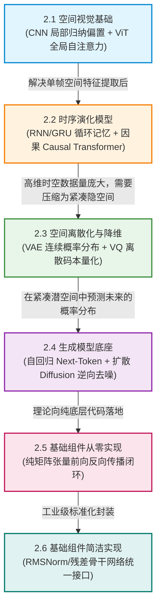

# 2.1 卷积神经网络与视觉 Transformer (CNN & ViT)

在世界模型与具身感知的广袤架构中，智能体接收到的第一手物理世界输入通常是由数百万个光子电信号汇聚而成的高维视觉图像。

然而，一张分辨率为 $1080\text{p}$ 的全彩图像包含超过六百万个浮点数，直接将这些原始像素输入全连接网络不仅会导致参数量发生天文数字级别的爆炸，更会彻底丢失图像内部蕴含的空间邻近性与平移不变性。

为了从高维像素海洋中高效提炼出物体的几何边缘、空间结构与全局语义，计算机视觉诞生了两大经典里程碑范式：
- **卷积神经网络（Convolutional Neural Networks, CNN）**：以局部感受野与权重共享为核心，具备极强的归纳偏置（Inductive Bias）；
- **视觉 Transformer（Vision Transformer, ViT）**：打破局部限制，将图像切分为词元序列，利用全局自注意力机制实现无尺度的全局依赖建模。

本节我们将从初等几何与滑动窗口矩阵运算出发，严密推导 CNN 的特征图尺寸演化、ViT 的 Patch 投影与自注意力方程，并使用纯底层 PyTorch 从零手写 CNN 骨干网络与 ViT 编码器。

---

## 【第 2 章全景认知脉络与递进逻辑图】

本章构建全书世界模型与具身智能所需的**深度学习与表征学习共同技术底座**。世界模型的本质是“在压缩的隐空间中对时序未来展开概率生成推演”，因此第 2 章按照**空间感知 $\to$ 时序推进 $\to$ 隐空间压缩 $\to$ 概率生成 $\to$ 纯底层代码闭环**的严密阶梯递进展开：



### 本章递进逻辑深度拆解：
1. **2.1 节（空间表征）**：解决单时刻二维物理画面的特征提取，掌握 CNN 的局部归纳偏置与 ViT 的全局自注意力机制；
2. **2.2 节（时序演进）**：跨越静态画面，引入时间轴，推导 RNN/GRU 的 BPTT 梯度反传与 Causal Transformer 的下三角因果掩码；
3. **2.3 节（流形压缩）**：解决原始高维数据的显存瓶颈，掌握 VAE 的重参数化技巧与 VQ-VAE 的离散码本量化；
4. **2.4 节（概率生成）**：在紧凑潜空间中构建未来推演的核心引擎，掌握自回归与去噪扩散（DDPM）两大生成范式；
5. **2.5 & 2.6 节（从零实现与工程封装）**：脱离黑盒框架，手写纯张量反向传播引擎，并完成工业级基础组件封装！

<div align="center">


_图 2.1-1：Vision Transformer (ViT) 将图像分割为固定大小的 Patch，经过线性投影和位置编码后输入标准 Transformer 编码器。 出处：[An Image is Worth 16x16 Words: Transformers for Image Recognition at Scale，Alexey Dosovitskiy et al.，2020](https://arxiv.org/abs/2010.11929)。_

</div>

---

## 2.1.1 物理与几何基石：图像的空间相关性与平移不变性

要理解视觉特征提取的本质，我们首先必须回到初等物理几何中自然图像的两大基础统计规律。

### 1. 局部相关性（Spatial Locality）
在自然物理世界中，图像中的一个像素与其物理相邻的周围几个像素（例如相距 1~3 个像素）存在极强的颜色与光照关联；而相隔数百像素之外的两个点，其统计相关性迅速衰减。
因此，特征提取器无需在第一步就连接图像的每一个角落，只需在微小的局部小窗口内滑动计算。

### 2. 平移不变性（Translation Invariance）
一只出现在图像左上角的猫，和一只出现在图像右下角的猫，其边缘、毛发纹理的微观几何特征是完全恒等的。
这意味着，用于检测“水平边缘”的算子（权重核），应当在整张图像的所有位置重复复用（权重共享）。

<div align="center">


_图 2.1-2：ResNet 残差学习单元通过跳跃连接解决深度网络退化问题。 出处：[Deep Residual Learning for Image Recognition，Kaiming He et al.，2016](https://arxiv.org/abs/1512.03385)。_

</div>

---

## 2.1.2 核心数学推导一：二维离散卷积与多通道滑动窗口

卷积运算在初等代数中可以直观地理解为一个在二维网格上滑动的加权求和窗口。

<div align="center">


_图 2.1-3：输入通道、卷积核与输出通道的多维张量收缩：沿输入通道做逐元素点乘并累加生成单通道特征。_

</div>

### 1. 二维多通道卷积离散数学公式
设输入特征图张量为 $\mathbf{X} \in \mathbb{R}^{C_{\text{in}} \times H \times W}$，卷积核权重张量为 $\mathbf{W} \in \mathbb{R}^{C_{\text{out}} \times C_{\text{in}} \times K_h \times K_w}$，偏置向量为 $\mathbf{b} \in \mathbb{R}^{C_{\text{out}}}$。

对于第 $k$ 个输出通道在坐标 $(i, j)$ 处的特征标量，计算公式为所有输入通道局部乘积的累加和：

$$\mathbf{Y}[k, i, j] = \mathbf{b}[k] + \sum_{c=1}^{C_{\text{in}}} \sum_{m=0}^{K_h-1} \sum_{n=0}^{K_w-1} \mathbf{W}[k, c, m, n] \cdot \mathbf{X}[c, \; i \cdot S_h + m - P_h, \; j \cdot S_w + n - P_w]$$

其中 $S_h, S_w$ 为步长（Stride），$P_h, P_w$ 为填充零的宽度（Padding）。

### 2. 输出特征图尺寸几何计算公式
根据初等几何网格划分，输出特征图的高度 $H_{\text{out}}$ 与宽度 $W_{\text{out}}$ 由经典解析式严格决定：

$$H_{\text{out}} = \left\lfloor \frac{H_{\text{in}} + 2 P_h - K_h}{S_h} \right\rfloor + 1, \quad W_{\text{out}} = \left\lfloor \frac{W_{\text{in}} + 2 P_w - K_w}{S_w} \right\rfloor + 1$$

### 3. 二维单通道卷积手算数值算例
设输入单通道特征图为 $3 \times 3$ 矩阵 $\mathbf{X}$，卷积核为 $2 \times 2$ 矩阵 $\mathbf{W}$，无填充（$P=0$），步长 $S=1$，偏置 $b = 1.0$：

$$\mathbf{X} = \begin{bmatrix} 1 & 2 & 0 \\ 0 & 3 & 1 \\ 2 & 1 & 0 \end{bmatrix}, \quad \mathbf{W} = \begin{bmatrix} 2 & -1 \\ 1 & 0 \end{bmatrix}$$

我们来一步步手动计算输出特征图 $\mathbf{Y}$ 的每个元素（$H_{\text{out}} = 3 - 2 + 1 = 2$）：
1. **左上角位置 $(0, 0)$**：输入窗口为 $\begin{bmatrix} 1 & 2 \\ 0 & 3 \end{bmatrix}$
   $$\mathbf{Y}[0, 0] = (1 \times 2 + 2 \times (-1) + 0 \times 1 + 3 \times 0) + 1.0 = (2 - 2 + 0 + 0) + 1.0 = 1.0$$
2. **右上角位置 $(0, 1)$**：输入窗口为 $\begin{bmatrix} 2 & 0 \\ 3 & 1 \end{bmatrix}$
   $$\mathbf{Y}[0, 1] = (2 \times 2 + 0 \times (-1) + 3 \times 1 + 1 \times 0) + 1.0 = (4 + 0 + 3 + 0) + 1.0 = 8.0$$
3. **左下角位置 $(1, 0)$**：输入窗口为 $\begin{bmatrix} 0 & 3 \\ 2 & 1 \end{bmatrix}$
   $$\mathbf{Y}[1, 0] = (0 \times 2 + 3 \times (-1) + 2 \times 1 + 1 \times 0) + 1.0 = (0 - 3 + 2 + 0) + 1.0 = 0.0$$
4. **右下角位置 $(1, 1)$**：输入窗口为 $\begin{bmatrix} 3 & 1 \\ 1 & 0 \end{bmatrix}$
   $$\mathbf{Y}[1, 1] = (3 \times 2 + 1 \times (-1) + 1 \times 1 + 0 \times 0) + 1.0 = (6 - 1 + 1 + 0) + 1.0 = 7.0$$

最终卷积输出矩阵为：
$$\mathbf{Y} = \begin{bmatrix} 1.0 & 8.0 \\ 0.0 & 7.0 \end{bmatrix}$$

整个过程完全由基础代数的点积累加驱动，清晰展现了卷积核如何扫描并提取空间局部模式！

<details>
<summary><b>深入推导：卷积反向传播中的互相关（Cross-Correlation）与卷积核翻转证明（点击展开查看完整推导）</b></summary>

设损失函数为 $\mathcal{L}$，输出特征图的梯度为 $\boldsymbol{\delta} = \frac{\partial \mathcal{L}}{\partial \mathbf{Y}}$。
根据多元复合函数求导链式法则，损失对输入特征图 $\mathbf{X}$ 的梯度为：
$$\frac{\partial \mathcal{L}}{\partial \mathbf{X}[i, j]} = \sum_{m, n} \boldsymbol{\delta}[i - m, j - n] \cdot \mathbf{W}[m, n] = (\boldsymbol{\delta} * \text{Rot}_{180^\circ}(\mathbf{W}))[i, j]$$
对权重核 $\mathbf{W}$ 的梯度为输入与输出梯度的互相关：
$$\frac{\partial \mathcal{L}}{\partial \mathbf{W}[m, n]} = \sum_{i, j} \boldsymbol{\delta}[i, j] \cdot \mathbf{X}[i + m, j + n]$$
该数学对称性奠定了深度卷积网络端到端反向传播（Backpropagation）的理论基础。
</details>

---

## 2.1.3 核心数学推导二：ViT 的 Patch 分块投影与多头自注意力

虽然 CNN 擅长捕获局部纹理，但由于卷积核感受野有限，建立长距离两个物体之间的全局空间联系需要堆叠数十层卷积。

2020 年，Dosovitskiy 等人提出的 **Vision Transformer (ViT)** 彻底抛弃了卷积，将整张图像切分为不重叠的小图像块，将计算机视觉统一到自然语言处理的纯注意力架构中。

<div align="center">


_图 2.1-4：ConvNeXt 借鉴 ViT 设计理念现代化重构标准卷积神经网络架构。 出处：[A ConvNet for the 2020s，Zhuang Liu et al.，2022](https://arxiv.org/abs/2201.03545)。_

</div>

### 1. 四步严密 ViT 前向特征变换流程
#### 步骤一：空间分块与线性投影（Patch Linear Embedding）
设输入图像为 $\mathbf{I} \in \mathbb{R}^{H \times W \times C}$，每个 Patch 尺寸为 $P \times P$（例如 $P=16$）。
图像被展平成 $N = \frac{H \cdot W}{P^2}$ 个向量 $\mathbf{x}_p \in \mathbb{R}^{N \times (P^2 C)}$。
通过可学习线性投影矩阵 $\mathbf{E} \in \mathbb{R}^{(P^2 C) \times D}$ 升维映射至隐藏维度 $D$：
$$\mathbf{Z}_0 = [\mathbf{x}_{\text{class}}; \; \mathbf{x}_p^1 \mathbf{E}; \; \mathbf{x}_p^2 \mathbf{E}; \dots; \; \mathbf{x}_p^N \mathbf{E}] + \mathbf{E}_{\text{pos}} \in \mathbb{R}^{(N+1) \times D}$$
其中 $\mathbf{x}_{\text{class}} \in \mathbb{R}^{1 \times D}$ 为可学习分类标记（CLS Token），$\mathbf{E}_{\text{pos}} \in \mathbb{R}^{(N+1) \times D}$ 为一维可学习空间位置编码。

#### 步骤二：查询、键、值矩阵生成（Q, K, V Generation）
$$\mathbf{Q} = \mathbf{Z} \mathbf{W}_Q, \quad \mathbf{K} = \mathbf{Z} \mathbf{W}_K, \quad \mathbf{V} = \mathbf{Z} \mathbf{W}_V \in \mathbb{R}^{(N+1) \times D}$$

#### 步骤三：缩放点积注意力与全局亲和度计算
$$\mathbf{A} = \text{Softmax}\left( \frac{\mathbf{Q} \mathbf{K}^\top}{\sqrt{d_k}} \right) \in \mathbb{R}^{(N+1) \times (N+1)}$$

#### 步骤四：多头加权值聚合与残差前馈网络
$$\text{Attention}(\mathbf{Q}, \mathbf{K}, \mathbf{V}) = \mathbf{A} \mathbf{V} \in \mathbb{R}^{(N+1) \times D}$$
$$\mathbf{Z}' = \text{LayerNorm}(\text{Attention}(\mathbf{Z})) + \mathbf{Z}$$
$$\mathbf{Z}_{\text{out}} = \text{LayerNorm}(\text{MLP}(\mathbf{Z}')) + \mathbf{Z}'$$

### 2. ViT 自注意力手算数值算例
设特征维度 $d_k = 2$，序列长度仅包含 2 个 Patch 词元：
- 查询矩阵 $\mathbf{Q} = \begin{bmatrix} 1.0 & 1.0 \\ 0.0 & 2.0 \end{bmatrix}$；
- 键矩阵 $\mathbf{K} = \begin{bmatrix} 1.0 & 1.0 \\ 2.0 & 0.0 \end{bmatrix}$；
- 值矩阵 $\mathbf{V} = \begin{bmatrix} 10.0 & 0.0 \\ 0.0 & 10.0 \end{bmatrix}$。

我们来手动求解词元 1 的注意力输出：
1. **计算点积除以 $\sqrt{2} \approx 1.414$**：
   $$S_{1, 1} = \frac{[1.0, 1.0] \cdot [1.0, 1.0]^\top}{1.414} = \frac{1.0 + 1.0}{1.414} = \frac{2.0}{1.414} \approx 1.414$$
   $$S_{1, 2} = \frac{[1.0, 1.0] \cdot [2.0, 0.0]^\top}{1.414} = \frac{2.0 + 0.0}{1.414} = \frac{2.0}{1.414} \approx 1.414$$
2. **计算 Softmax 权重**：
   $$\exp(S_{1, 1}) = e^{1.414} \approx 4.112, \quad \exp(S_{1, 2}) = e^{1.414} \approx 4.112$$
   $$A_{1, 1} = \frac{4.112}{4.112 + 4.112} = 0.50, \quad A_{1, 2} = \frac{4.112}{4.112 + 4.112} = 0.50$$
3. **加权汇聚 Value**：
   $$\mathbf{O}_1 = 0.50 \times [10.0, 0.0] + 0.50 \times [0.0, 10.0] = [5.0, 5.0]$$

初等代数的直观运算生动证实：词元 1 以均等的 $50\%$ 权重同时从全局的两个位置融合了特征，打破了卷积的局部窗口束缚！

<details>
<summary><b>深入推导：自注意力矩阵的点积核方法与无参数归纳偏置表达能力分析（点击展开查看完整推导）</b></summary>

自注意力机制可视为具有动态自适应核函数的积分变换：
$$f(\mathbf{x}_i) = \int_{\Omega} \kappa(\mathbf{x}_i, \mathbf{x}_j) g(\mathbf{x}_j) d\mathbf{x}_j, \quad \kappa(\mathbf{x}_i, \mathbf{x}_j) = \frac{\exp(\langle \mathbf{W}_Q \mathbf{x}_i, \mathbf{W}_K \mathbf{x}_j \rangle / \sqrt{D})}{\int_\Omega \exp(\langle \mathbf{W}_Q \mathbf{x}_i, \mathbf{W}_K \mathbf{x}_z \rangle / \sqrt{D}) d\mathbf{x}_z}$$
由于核函数 $\kappa$ 处处全局非零，ViT 移除了 CNN 强制假定的二维局部网格拓扑先验。当数据规模趋于无穷大时，由通用逼近定理，ViT 能够学习到任意任意复杂的长程几何非局部映射。
</details>

---

## 2.1.4 纯底层 PyTorch 代码实现：从零手写 CNN 残差块与 Vision Transformer 编码器

下面我们使用纯底层 PyTorch 算子实现一个完整的 ResNet 残差卷积块与轻量级 Vision Transformer 编码网络。

```python
import torch
import torch.nn as nn
import torch.nn.functional as F

class ResidualBlock(nn.Module):
    """
    经典 ResNet 残差卷积块 (BasicBlock)
    y = ReLU(x + Conv2(ReLU(Conv1(x))))
    """
    def __init__(self, channels: int):
        super().__init__()
        self.conv1 = nn.Conv2d(channels, channels, kernel_size=3, padding=1, bias=False)
        self.bn1 = nn.BatchNorm2d(channels)
        self.conv2 = nn.Conv2d(channels, channels, kernel_size=3, padding=1, bias=False)
        self.bn2 = nn.BatchNorm2d(channels)

    def forward(self, x: torch.Tensor) -> torch.Tensor:
        residual = x
        out = F.relu(self.bn1(self.conv1(x)))
        out = self.bn2(self.conv2(out))
        out += residual
        return F.relu(out)

class VisionTransformerEncoder(nn.Module):
    """
    纯底层 Vision Transformer (ViT) 编码器
    包含 Patch 展开投影、位置编码与 Transformer 自注意力层
    """
    def __init__(self, img_size: int = 32, patch_size: int = 4, in_c: int = 3, d_model: int = 64, num_layers: int = 2):
        super().__init__()
        self.patch_size = patch_size
        self.num_patches = (img_size // patch_size) ** 2
        self.d_model = d_model

        # 1. Patch 线性投影层 (将 4x4x3 = 48 维展平向量投影至 d_model)
        self.patch_proj = nn.Linear(patch_size * patch_size * in_c, d_model)

        # 2. 可学习 CLS Token 与一维位置编码
        self.cls_token = nn.Parameter(torch.randn(1, 1, d_model) * 0.02)
        self.pos_embed = nn.Parameter(torch.randn(1, self.num_patches + 1, d_model) * 0.02)

        # 3. Transformer 编码层
        encoder_layer = nn.TransformerEncoderLayer(
            d_model=d_model, nhead=4, dim_feedforward=d_model * 2, batch_first=True
        )
        self.transformer = nn.TransformerEncoder(encoder_layer, num_layers=num_layers)

    def forward(self, x: torch.Tensor) -> torch.Tensor:
        """
        :param x: (B, in_c, H, W) 图像输入
        :return: (B, num_patches + 1, d_model) 视觉特征词元序列
        """
        B, C, H, W = x.shape
        P = self.patch_size

        # 将图像切分为小块并展平: (B, C, H/P, P, W/P, P) -> (B, num_patches, P*P*C)
        patches = x.unfold(2, P, P).unfold(3, P, P).permute(0, 2, 4, 1, 5, 6).contiguous()
        patches = patches.view(B, self.num_patches, -1)

        # 线性投影
        tokens = self.patch_proj(patches) # (B, num_patches, d_model)

        # 拼接 CLS Token 与累加位置编码
        cls_tokens = self.cls_token.expand(B, -1, -1)
        tokens = torch.cat([cls_tokens, tokens], dim=1) # (B, num_patches + 1, d_model)
        tokens = tokens + self.pos_embed

        # Transformer 自注意力演变
        out_tokens = self.transformer(tokens)
        return out_tokens

# ===================================================================
# 单元测试与张量维度校验
# ===================================================================
if __name__ == "__main__":
    batch_size = 2
    img_h, img_w = 32, 32

    # 1. 测试残差卷积块
    res_block = ResidualBlock(channels=16)
    dummy_cnn_input = torch.randn(batch_size, 16, img_h, img_w)
    cnn_out = res_block(dummy_cnn_input)
    print(f"[CNN Test] 输入形状: {dummy_cnn_input.shape} -> 输出形状: {cnn_out.shape}")
    assert cnn_out.shape == dummy_cnn_input.shape, "残差块输出形状不匹配！"

    # 2. 测试 Vision Transformer 编码器
    vit_encoder = VisionTransformerEncoder(img_size=32, patch_size=4, in_c=3, d_model=64)
    dummy_vit_input = torch.randn(batch_size, 3, img_h, img_w)
    vit_out = vit_encoder(dummy_vit_input)

    expected_len = (32 // 4) ** 2 + 1 # 64 patches + 1 cls = 65
    print(f"[ViT Test] 视觉词元序列输出形状: {vit_out.shape} (期望: [{batch_size}, {expected_len}, 64])")

    assert vit_out.shape == (batch_size, expected_len, 64), "ViT 词元序列维度不符！"
    assert not torch.isnan(vit_out).any(), "ViT 运算出现 NaN！"
    print("✓ CNN 残差块与 Vision Transformer 编码器单测全部通过！")
```

---

## 2.1.5 本节小结

回顾本节内容，我们建立了视觉特征提取的两大核心支柱：
1. **CNN 的归纳偏置**：通过局部感受野与权重共享，以极高效率编码图像的平移不变性与微观边缘纹理；
2. **ViT 的全局自由度**：通过将图像切分为 Patch 词元序列与全维自注意力，打破了局部卷积的视野局限，实现了大模型时代的通用视觉表征；
3. **特征形态融合**：现代具身世界模型往往将 CNN 的浅层局部感知与 Transformer 的深层语义推理相结合，构建起坚固的多尺度空间感知底座。
