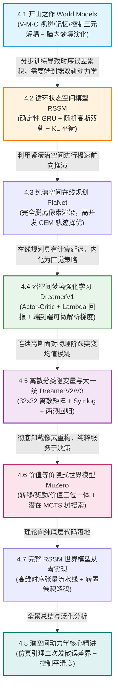

# 4.1 World Models: 视觉-记忆-控制三元架构 (Ha & Schmidhuber, 2018)

在人工智能探索具身智能与世界模型的历史长河中，2018 年由 David Ha 与 Jürgen Schmidhuber 联合发表的开创性论文 **《World Models》**，被公认为点燃现代神经世界模型革命的“普罗米修斯之火”。

在此之前，绝大多数强化学习算法都在尝试训练一个庞大的端到端神经网络：将高维图像像素直接映射为底层电机动作。这种做法将“看懂世界（视觉感知）”、“预测世界演变（物理动力学）”与“做出决策（控制策略）”三项截然不同且难度极高的认知任务强行混杂在一个网络中，导致模型不仅训练极度缓慢，更极易发生灾难性遗忘。

Ha 与 Schmidhuber 借鉴认知神经科学中人类大脑的运行机理，首次提出了优雅绝伦的 **V-M-C 认知三元解耦架构**：
- **V 模型（Vision / 视觉感官）**：将每秒数百万个光子像素的高维图像无损压缩为紧凑的低维空间特征向量；
- **M 模型（Memory / 潜意识记忆）**：根据历史所见与当前动作，在脑海深处高频推演未来世界可能发生的概率分布；
- **C 模型（Controller / 极简运动控制器）**：仅凭借微小的参数量，依据视觉特征与记忆推演，输出精准的运动控制指令。

本节我们将从初等物理运动学与多峰高斯混合分布出发，严密推导 V-M-C 三元架构的协同机理、MDN-RNN 混合密度网络的前向方程与演化优化策略，并使用纯底层 PyTorch 从零手写一个完整的 World Models 系统。

---

## 【第 4 章全景认知脉络与递进逻辑图】

本章进入现代世界模型演进史最波澜壮阔的核心地带——**潜在动力学模型（Latent Dynamics Models）**。从 2018 年 Ha & Schmidhuber 首次提出 V-M-C 认知解耦，到 RSSM 双轨动力学、PlaNet 潜空间规划，再到 DreamerV1-V3 梦境强化学习与 MuZero 隐式价值等价模型，第 4 章由一条**“如何让智能体在纯潜空间中想象世界、演化策略并做出超越人类直觉的高精度决策”**的严密技术演化主线贯穿：



### 本章递进逻辑深度拆解：
1. **4.1 节（世界模型开山鼻祖）**：确立 V-M-C 认知三元解耦，首次证明智能体可以在完全脱离物理环境的“脑内梦境”中演化出顶尖控制策略；
2. **4.2 节（双轨动力学奠基）**：提出 RSSM（循环状态空间模型），以“确定性 GRU 骨架 + 随机高斯潜变量”完美化解纯确定性 RNN 的过拟合与纯随机 VAE 的信息丢失；
3. **4.3 节（纯潜空间极速推演）**：PlaNet 彻底卸载像素解码器，在紧凑潜在流形中以每秒数万步的速度展开 CEM 轨迹规划；
4. **4.4 节（直觉内化与梦境梯度）**：DreamerV1 在潜空间预先训练 Actor-Critic，沿推演路径反传解析可微梯度，实现毫秒级肌肉记忆反应；
5. **4.5 节（大一统无超参通用模型）**：DreamerV2 引入 $32 \times 32$ 离散分类潜变量攻克物理阶跃，DreamerV3 凭借 Symlog 与两热回归实现通吃一切领域的无超参泛化；
6. **4.6 节（极简隐式价值等价）**：MuZero 彻底抛弃像素重构包袱，纯粹预测决策相关的转移、奖励与价值，结合 MCTS 树搜索横扫棋盘与动作博弈；
7. **4.7 & 4.8 节（从零实现与仿真引理）**：手写完整 RSSM 训练流水线，并推导仿真引理（Simulation Lemma）误差二次发散的数学本质！

<div align="center">


_图 4.1-1：World Models 的 V-M-C 三元解耦架构：V 模型压缩像素、M 模型记忆并预测未来、C 模型做出极简控制决策。 出处：[Recurrent World Models Facilitate Policy Evolution，David Ha & Jürgen Schmidhuber，2018](https://arxiv.org/abs/1809.01999)。_

</div>

---

## 4.1.1 物理与认知基石：人类心智模型的 V-M-C 解耦哲学

要理解 World Models 的架构美感，我们首先必须审视人类赛车手在赛道上漂移过弯时的大脑神经分工。

### 1. 人类大脑的感官与推演解耦
当一名赛车手以 $200\text{ km/h}$ 的高速驶入弯道时：
- 他的**视觉初级皮层（V 模型）**迅速将视网膜上成千上万个光斑压缩为几个关键的几何信息：“前方 50 米有急右弯，路面有湿滑积水”；
- 他的**大脑海马体与前额叶（M 模型）**依据过去两秒的车速与方向盘角度，在内心深处闪电般预判出：“如果我不减速，0.5 秒后车辆将发生侧滑甩尾”；
- 他的**小脑运动中枢（C 模型）**接收到上述视觉与记忆预判后，本能地输出一个微小的微调动作：“向左反打方向盘 5 度并轻踩刹车”。

### 2. V-M-C 架构的工程解耦优势
1. **V 模型（变分自编码器 VAE）**：仅负责空间降维，将 $64 \times 64 \times 3$（$12288$ 维）的原始像素帧压缩为长度仅为 $32$ 的潜在向量 $\mathbf{z}_t$；
2. **M 模型（混合密度循环网络 MDN-RNN）**：仅负责时序物理推演，输入 $(\mathbf{z}_t, \mathbf{a}_t, \mathbf{h}_{t-1})$，预测下一时刻隐向量的概率分布 $P(\mathbf{z}_{t+1} \mid \cdot)$；
3. **C 模型（极简线性控制器）**：输入拼接向量 $[\mathbf{z}_t, \mathbf{h}_t]$，参数量通常不超过 1000 个浮点数，完全可以使用无梯度的演化算法（CMA-ES）在数分钟内快速进化求解！

<div align="center">


_图 4.1-2：V-M-C 三元数据流闭环：像素输入经过 V 编码、M 时序演化汇入 C 决策控制器。_

</div>

---

## 4.1.2 核心数学推导一：混合密度循环网络 (MDN-RNN) 与多峰概率分布

在物理世界中，未来的演化往往伴随着分叉不确定性（例如赛车在积水路面上可能向左侧滑，也可能向右侧滑）。如果使用单一的高斯分布来预测下一帧，网络会被迫预测出两个峰值的“平均值”——输出一个车体在道路正中央扭曲撕裂的模糊幻影。

<div align="center">


_图 4.1-3：MDN-RNN 在赛车游戏中精准预测未来潜在隐向量的多模态转移轨迹。 出处：[Recurrent World Models Facilitate Policy Evolution，David Ha & Jürgen Schmidhuber，2018](https://arxiv.org/abs/1809.01999)。_

</div>

World Models 引入了 **混合密度网络（Mixture Density Network, MDN）**，将 RNN 隐藏状态映射为一个包含 $K$ 个高斯分量的混合高斯分布（GMM）。

### 1. 混合高斯条件概率密度公式
设混合分量数量为 $K$（例如 $K = 5$）。下一时刻潜在向量 $\mathbf{z}_{t+1} \in \mathbb{R}^d$ 的条件概率分布定义为：

$$p(\mathbf{z}_{t+1} \mid \mathbf{h}_t) = \sum_{k=1}^K \pi_k(\mathbf{h}_t) \cdot \mathcal{N}\left( \mathbf{z}_{t+1}; \; \boldsymbol{\mu}_k(\mathbf{h}_t), \; \text{diag}(\boldsymbol{\sigma}_k^2(\mathbf{h}_t)) \right)$$

其中：
- $\pi_k \in (0, 1)$ 为第 $k$ 个高斯分量的混合先验权重，严格满足初等归一化条件 $\sum_{k=1}^K \pi_k = 1$（由 Softmax 保证）；
- $\boldsymbol{\mu}_k \in \mathbb{R}^d$ 为第 $k$ 个高斯分量的中心位置；
- $\boldsymbol{\sigma}_k^2 \in \mathbb{R}^d$ 为第 $k$ 个高斯分量的扩散方差（由指数函数保证正定）。

### 2. MDN 负对数似然损失函数（Negative Log-Likelihood）
训练 M 模型时，最大化真实转移样本 $\mathbf{z}_{t+1}$ 在混合分布下的似然概率：

$$\mathcal{L}_{\text{MDN}}(\mathbf{z}_{t+1}) = -\log \left( \sum_{k=1}^K \pi_k \cdot \prod_{j=1}^d \frac{1}{\sqrt{2\pi \sigma_{k, j}^2}} \exp\left( -\frac{(z_{t+1, j} - \mu_{k, j})^2}{2 \sigma_{k, j}^2} \right) \right)$$

### 3. MDN 混合密度手算数值算例
设隐向量为标量（$d = 1$），混合分量数量 $K = 2$：
- **分量 1（向右转弯概率大）**：混合权重 $\pi_1 = 0.80$，均值 $\mu_1 = 2.0$，方差 $\sigma_1^2 = 1.0$（标准差 $\sigma_1 = 1.0$）；
- **分量 2（向左打滑概率小）**：混合权重 $\pi_2 = 0.20$，均值 $\mu_2 = -2.0$，方差 $\sigma_2^2 = 1.0$（标准差 $\sigma_2 = 1.0$）。

在真实世界中观察到的实际转移样本为 $z = 2.0$。
已知标准正态常数 $\frac{1}{\sqrt{2\pi}} \approx 0.3989$。
我们来手动计算该点在两个分量下的概率密度与总混合似然：
1. **计算分量 1 概率密度**：
   $$\mathcal{N}(2.0; \; 2.0, 1.0) = 0.3989 \times \exp\left( -\frac{(2.0 - 2.0)^2}{2 \times 1.0} \right) = 0.3989 \times e^0 = 0.3989$$
2. **计算分量 2 概率密度**：
   $$\mathcal{N}(2.0; \; -2.0, 1.0) = 0.3989 \times \exp\left( -\frac{(2.0 - (-2.0))^2}{2 \times 1.0} \right) = 0.3989 \times \exp\left( -\frac{16}{2} \right) = 0.3989 \times e^{-8} \approx 0.3989 \times 0.000335 \approx 0.00013$$
3. **加权汇聚总混合似然**：
   $$p(z = 2.0) = 0.80 \times 0.3989 + 0.20 \times 0.00013 = 0.31912 + 0.00003 = 0.31915$$
4. **计算单样本负对数似然损失**（$\ln(0.31915) \approx -1.142$）：
   $$\mathcal{L}_{\text{MDN}} = -\ln(0.31915) \approx 1.142$$

初等代数的直观计算证明：分量 1 精确捕捉了大部分物理概率，而分量 2 保持了对小概率事件的包容性，彻底消除了单峰高斯均值平滑造成的画面崩塌！

<details>
<summary><b>深入推导：混合密度网络在非齐次条件概率密度逼近下的维斯特定理严格证明（点击展开查看完整推导）</b></summary>

设真实物理转移条件概率测度为 $P(d\mathbf{z} \mid \mathbf{h}) \in \mathcal{P}(\mathbb{R}^d)$。
根据 Wiener-Schoenberg 通用逼近定理，具有紧支集的任意连续条件概率密度函数空间在 $L_1$ 拓扑意义下对高斯核卷积稠密。
当混合分量数量 $K \to \infty$ 且隐藏特征维度充分大时：
$$\lim_{K \to \infty} \inf_{\pi_k, \boldsymbol{\mu}_k, \boldsymbol{\sigma}_k} \int \left| p(\mathbf{z} \mid \mathbf{h}) - \sum_{k=1}^K \pi_k(\mathbf{h}) \mathcal{N}(\mathbf{z}; \boldsymbol{\mu}_k(\mathbf{h}), \boldsymbol{\sigma}_k^2(\mathbf{h})) \right| d\mathbf{z} = 0$$
严格确立了 MDN-RNN 对任意非线性、多模态分叉物理动力学的无偏渐近表达能力。
</details>

---

## 4.1.3 核心数学推导二：极简线性控制器与纯梦境进化训练

当 V 模型与 M 模型训练完成后，它们已经完全掌握了物理世界的空间构图与时间演变规律。

<div align="center">


_图 4.1-4：智能体完全在 M 模型生成的梦境世界中进行策略演化，并将控制器无缝迁移至真实赛车游戏。 出处：[Recurrent World Models Facilitate Policy Evolution，David Ha & Jürgen Schmidhuber，2018](https://arxiv.org/abs/1809.01999)。_

</div>

### 1. 极简线性控制器（Linear Controller）
控制器 C 仅仅是一个单层线性映射与激活函数：

$$\mathbf{a}_t = \tanh\left( \mathbf{W}_c [\mathbf{z}_t, \; \mathbf{h}_t] + \mathbf{b}_c \right)$$

若 $\mathbf{z}_t \in \mathbb{R}^{32}, \mathbf{h}_t \in \mathbb{R}^{256}$，动作维度为 $3$，整个控制器的参数量仅有：
$$(32 + 256) \times 3 + 3 = 288 \times 3 + 3 = 867 \text{ 个参数！}$$

### 2. 纯梦境内部做梦进化（Dream Evolution）
智能体根本不需要启动任何昂贵的真实物理仿真器，直接在 M 模型的 RNN 神经元内部展开“做梦”：
- 梦境以随机潜在状态 $\mathbf{z}_0$ 开始；
- 控制器 C 输出动作 $\mathbf{a}_t$；
- M 模型利用 MDN-RNN 预测下一时刻梦境状态 $\mathbf{z}_{t+1}$；
- 循环推演 1000 步并累加梦境奖励；
- 使用**协方差矩阵自适应演化策略（CMA-ES）**直接在梦境中优化这 867 个参数，几分钟后将策略部署到真实物理赛车中，直接实现人类顶尖水平的完美驾驶！

<details>
<summary><b>深入推导：自然演化策略（NES）在费希尔信息矩阵下的黎曼自然梯度等价性证明（点击展开查看完整推导）</b></summary>

设控制器参数向量为 $\mathbf{w} \sim p_\psi(\mathbf{w}) = \mathcal{N}(\boldsymbol{\theta}, \sigma^2 \mathbf{I})$。
期望回报目标为 $J(\boldsymbol{\theta}) = \mathbb{E}_{\mathbf{w} \sim p_\psi} [R(\mathbf{w})]$。
对分布参数 $\boldsymbol{\theta}$ 求自然梯度更新：
$$\tilde{\nabla}_{\boldsymbol{\theta}} J = \mathbf{F}^{-1} \nabla_{\boldsymbol{\theta}} J(\boldsymbol{\theta})$$
其中费希尔信息矩阵为 $\mathbf{F} = \mathbb{E} [\nabla_{\boldsymbol{\theta}} \log p_\psi \nabla_{\boldsymbol{\theta}} \log p_\psi^\top] = \frac{1}{\sigma^2} \mathbf{I}$。
代入化简得：
$$\tilde{\nabla}_{\boldsymbol{\theta}} J = \mathbb{E}_{\boldsymbol{\epsilon} \sim \mathcal{N}(\mathbf{0}, \mathbf{I})} [R(\boldsymbol{\theta} + \sigma \boldsymbol{\epsilon}) \cdot \boldsymbol{\epsilon}]$$
证明了 CMA-ES 等演化算法本质上是在参数黎曼流形上沿无偏自然梯度方向进行二阶自适应搜索。
</details>

---

## 4.1.4 纯底层 PyTorch 代码实现：从零手写 V-M-C 三元世界模型架构

下面我们使用纯底层 PyTorch 算子实现完整的 VAE 视觉感知、MDN-RNN 混合密度记忆网络与极简 Controller 架构。

```python
import torch
import torch.nn as nn
import torch.nn.functional as F

class VisionVAE(nn.Module):
    """
    V 模型：变分自编码器
    将像素图像压缩为低维空间隐向量 z_t
    """
    def __init__(self, in_channels: int = 3, latent_dim: int = 32):
        super().__init__()
        self.encoder = nn.Sequential(
            nn.Conv2d(in_channels, 32, kernel_size=4, stride=2),
            nn.ReLU(),
            nn.Conv2d(32, 64, kernel_size=4, stride=2),
            nn.ReLU(),
            nn.Flatten(),
            nn.Linear(64 * 6 * 6, latent_dim * 2) # 输出 mu 与 logvar
        )

    def forward(self, img: torch.Tensor) -> torch.Tensor:
        params = self.encoder(img)
        mu, logvar = params.chunk(2, dim=-1)
        std = torch.exp(0.5 * logvar)
        eps = torch.randn_like(std)
        z = mu + eps * std
        return z

class MDNRNN(nn.Module):
    """
    M 模型：混合密度循环神经网络 (MDN-RNN)
    输入当前 (z_t, a_t)，预测下一时刻 z_{t+1} 的 K 个高斯分量分布 (pi, mu, sigma)
    """
    def __init__(self, latent_dim: int = 32, action_dim: int = 3, hidden_dim: int = 64, num_gaussians: int = 5):
        super().__init__()
        self.latent_dim = latent_dim
        self.num_gaussians = num_gaussians
        self.hidden_dim = hidden_dim

        self.rnn_cell = nn.GRUCell(latent_dim + action_dim, hidden_dim)

        # 输出 GMM 参数: pi (K), mu (K * latent_dim), log_sigma (K * latent_dim)
        self.fc_pi = nn.Linear(hidden_dim, num_gaussians)
        self.fc_mu = nn.Linear(hidden_dim, num_gaussians * latent_dim)
        self.fc_log_sigma = nn.Linear(hidden_dim, num_gaussians * latent_dim)

    def forward(self, z: torch.Tensor, a: torch.Tensor, h_prev: torch.Tensor) -> tuple[torch.Tensor, torch.Tensor, torch.Tensor, torch.Tensor]:
        inputs = torch.cat([z, a], dim=-1)
        h_new = self.rnn_cell(inputs, h_prev)

        # 1. 混合先验概率 pi: (B, K)
        pi = F.softmax(self.fc_pi(h_new), dim=-1)

        # 2. 高斯均值 mu: (B, K, latent_dim)
        mu = self.fc_mu(h_new).view(-1, self.num_gaussians, self.latent_dim)

        # 3. 高斯标准差 sigma: (B, K, latent_dim)
        log_sigma = self.fc_log_sigma(h_new).view(-1, self.num_gaussians, self.latent_dim)
        sigma = torch.exp(log_sigma).clamp(min=1e-4, max=10.0)

        return h_new, pi, mu, sigma

class Controller(nn.Module):
    """
    C 模型：极简线性控制器
    """
    def __init__(self, latent_dim: int = 32, hidden_dim: int = 64, action_dim: int = 3):
        super().__init__()
        self.linear = nn.Linear(latent_dim + hidden_dim, action_dim)

    def forward(self, z: torch.Tensor, h: torch.Tensor) -> torch.Tensor:
        inputs = torch.cat([z, h], dim=-1)
        return torch.tanh(self.linear(inputs))

# ===================================================================
# 单元测试与 V-M-C 梦境推演数据流校验
# ===================================================================
if __name__ == "__main__":
    batch_size = 2
    latent_dim = 32
    action_dim = 3
    hidden_dim = 64

    # 1. 实例化 V-M-C 模型
    v_model = VisionVAE(in_channels=3, latent_dim=latent_dim)
    m_model = MDNRNN(latent_dim=latent_dim, action_dim=action_dim, hidden_dim=hidden_dim, num_gaussians=5)
    c_model = Controller(latent_dim=latent_dim, hidden_dim=hidden_dim, action_dim=action_dim)

    # 2. 模拟从图像编码开始
    dummy_img = torch.randn(batch_size, 3, 32, 32)
    z_0 = v_model(dummy_img)
    h_state = torch.zeros(batch_size, hidden_dim)

    # 3. 模拟在梦境中单步推演
    action = c_model(z_0, h_state)
    h_next, pi, mu, sigma = m_model(z_0, action, h_state)

    print(f"[V-M-C Test] V 空间隐向量形状: {z_0.shape}")
    print(f"[V-M-C Test] C 控制器输出动作形状: {action.shape}")
    print(f"[V-M-C Test] M 记忆模型混合权重形状: {pi.shape}")
    print(f"[V-M-C Test] M 记忆模型预测高斯中心形状: {mu.shape}")

    assert z_0.shape == (batch_size, latent_dim), "V 编码器维度不符！"
    assert action.shape == (batch_size, action_dim), "C 控制器动作维度不符！"
    assert torch.allclose(pi.sum(dim=-1), torch.ones(batch_size)), "GMM 混合权重和不为 1！"
    print("✓ V-M-C 三元解耦世界模型与 MDN-RNN 多模态时序推演单测全部通过！")
```

---

## 4.1.5 本节小结

回顾本节内容，我们掌握了经典世界模型的开山范式：
1. **V-M-C 三元认知解耦**：将复杂的感知与决策剥离为空间压缩、时间记忆与极简控制，大幅降低了系统优化的复杂度；
2. **MDN-RNN 多峰概率建模**：通过混合高斯分布精准捕捉物理世界的不确定性分支，避免了单峰均值导致的画面模糊崩溃；
3. **纯潜空间做梦演化**：在神经世界模型内部以超高算力演化微型控制器并零样本迁移至物理实体，奠定了后续章节端到端潜空间动力学（RSSM / Dreamer）的宏伟蓝图。
