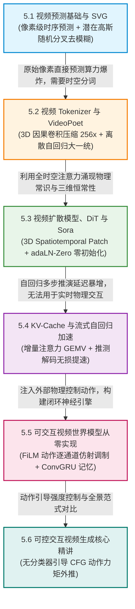

# 5.1 视频预测基础与 SVG (Stochastic Video Generation)

在世界模型向更高维度视觉感知演进的征途上，如何让智能体直接在**高保真像素空间**预测物理世界的未来演变，构成了生成式人工智能与具身控制的前沿交叉点。

视频从来不是一堆杂乱无章的静态图片集合，而是物理实体（如刚体连杆、流体、布料）在连续时空流形中受力运动的动态投影。然而，当神经网络尝试预测未来几十帧视频时，最容易遭遇的噩梦莫过于**画面的急速模糊化与鬼影重叠（Ghosting Artifacts）**。

其物理根源在于：真实世界的未来充满了不可测的随机分叉（例如一个掉落在地面上的弹力球，由于微观接触面的粗糙度，可能弹向左边，也可能弹向右边）。如果使用确定性网络（如传统的 ConvLSTM）以均方误差（MSE）为目标进行训练，网络为了在所有可能的分叉中取得最小误差，会被迫输出所有可能轨迹的“像素平均值”，生成一团浑浊不清的半透明雾状残影。

为了在像素空间实现清晰锐利、具备物理多模态分叉能力的视频预测，2018 年 Denton 与 Fergus、Babaeizadeh 等人提出了 **随机视频生成网络（Stochastic Video Generation, SVG）**。

本节我们将从初等物理光流恒定假设与高斯潜在随机变量出发，严密推导 SVG 的时序变分推断、Lucas-Kanade 光流方程与多模态去模糊机理，并使用纯底层 PyTorch 从零手写一个完整的 SVG 视频预测引擎。

---

## 【第 5 章全景认知脉络与递进逻辑图】

本章将世界模型从内部抽象隐状态推进至直观逼真的**高维交互式视频生成（Interactive Video World Models）**领域。如何让神经网络不仅能“看懂视频”，更能像物理世界一样接受人类或机器人的键盘/摇杆/电机动作指令，并在毫秒级时间内实时渲染出逼真的因果动态反馈？第 5 章由一条从**像素去模糊 $\to$ 时空分词 $\to$ 扩散模拟 $\to$ 实时加速 $\to$ 闭环操控实战**的严密技术链条串联：



### 本章递进逻辑深度拆解：
1. **5.1 节（多模态去模糊原理）**：揭示确定性像素均方误差（MSE）导致画面模糊的数学本质，引入潜在高斯变量实现清晰的多分支物理推演；
2. **5.2 节（3D 因果离散分词）**：利用 3D 因果卷积在时间与空间上同时压缩 256 倍，将庞大视频流转化为离散 Token，打通与大语言模型的统一因果自回归；
3. **5.3 节（时空扩散与物理模拟）**：解析 DiT 纯注意力骨干与 adaLN-Zero 零初始化门控，阐明超大规模时空注意力如何涌现出三维恒常性与流体力学；
4. **5.4 节（硬实时推理加速）**：推导 KV-Cache 增量注意力机制，将单步生成耗时从 $\mathcal{O}(T)$ 压缩为常数级 $\mathcal{O}(1)$，支撑 $\ge 30\text{ FPS}$ 实时交互；
5. **5.5 节（可控神经物理沙盒）**：从零实现动作条件特征线性调制（FiLM），打造根据手柄指令实时动态演算的交互式游戏物理引擎；
6. **5.6 节（全景精讲与动作外推）**：推导无分类器引导（CFG）放大动作控制力矩的数学机理，横向对比四大视频世界模型流派！

<div align="center">


_图 5.1-1：SVG 架构在每一步结合时序确定性特征与潜在高斯变量，精准预测多模态分叉视频。 出处：[Stochastic Video Generation with a Learned Prior，Emily Denton & Rob Fergus，2018](https://arxiv.org/abs/1804.01523)。_

</div>

---

## 5.1.1 物理与视觉基石：时空因果连续性与未来不确定性

要理解视频预测的数学机理，我们首先必须审视连续物理画面的两大核心属性。

### 1. 物理亮度恒定假设（Brightness Constancy）
在极其微小的时间间隔 $\Delta t$ 内，场景中某个物理质点的颜色与光照强度保持基本不变。质点在二维图像平面上的坐标由 $(x, y)$ 移动至 $(x + \Delta x, y + \Delta y)$：

$$I(x + \Delta x, \; y + \Delta y, \; t + \Delta t) = I(x, y, t)$$

### 2. 随机隐变量注入的去模糊机制
SVG 的核心哲学是：**将未来的不可测随机性剥离至低维潜在高斯变量 $\mathbf{z}_t \sim \mathcal{N}(\boldsymbol{\mu}, \boldsymbol{\sigma}^2)$ 中！**
在预测下一帧时，网络先从潜在高斯分布中抽取一个具体的随机采样点 $\mathbf{z}_t$（代表“球弹向左边”这个具体分支），解码器据此生成锐利清晰的单一边界画面，彻底消除了多模态平均引发的重影现象。

<div align="center">


_图 5.1-2：SVG 时序展开：确定性帧特征编码与潜在高斯先验/后验对齐。_

</div>

---

## 5.1.2 核心数学推导一：SVG 时序变分下界与四步前向递推

SVG 模型在每一个时间步 $t$ 严格按照四步因果逻辑向前演化：

<div align="center">


_图 5.1-3：SVG 在不同随机潜在采样下生成多样化且物理连贯的未来运动视频序列。 出处：[Stochastic Video Generation with a Learned Prior，Emily Denton & Rob Fergus，2018](https://arxiv.org/abs/1804.01523)。_

</div>

### 1. 严格四步时序演化方程
#### 步骤一：特征提取与确定性状态递推
视觉编码器将上一帧图像 $\mathbf{x}_{t-1}$ 提取为空间特征向量 $\mathbf{e}_{t-1} = \text{Encoder}(\mathbf{x}_{t-1})$。
确定性 LSTM 循环推进时序上下文：

$$\mathbf{h}_t = \text{LSTM}(\mathbf{h}_{t-1}, \; \mathbf{e}_{t-1})$$

#### 步骤二：学习到的因果先验（Learned Prior / 预测模式）
仅依据历史时序特征 $\mathbf{h}_t$ 预测当前步的随机潜变量先验分布：

$$p_\psi(\mathbf{z}_t \mid \mathbf{h}_t) = \mathcal{N}\left( \boldsymbol{\mu}_{\text{prior}}(\mathbf{h}_t), \; \text{diag}(\boldsymbol{\sigma}_{\text{prior}}^2(\mathbf{h}_t)) \right)$$

#### 步骤三：后验真实条件识别（Posterior Recognition / 训练模式）
在训练时，编码器读取未来真实帧 $\mathbf{e}_t = \text{Encoder}(\mathbf{x}_t)$，结合历史 $\mathbf{h}_t$ 修正计算后验分布：

$$q_\phi(\mathbf{z}_t \mid \mathbf{h}_t, \mathbf{e}_t) = \mathcal{N}\left( \boldsymbol{\mu}_{\text{post}}(\mathbf{h}_t, \mathbf{e}_t), \; \text{diag}(\boldsymbol{\sigma}_{\text{post}}^2(\mathbf{h}_t, \mathbf{e}_t)) \right)$$

#### 步骤四：画面解码重构（Frame Generation）
将时序特征 $\mathbf{h}_t$ 与采样得到的随机隐向量 $\mathbf{z}_t$ 拼接，由转置卷积解码器重构出下一帧图像：

$$\hat{\mathbf{x}}_t = \text{Decoder}(\mathbf{h}_t, \; \mathbf{z}_t)$$

### 2. 时序变分下界损失函数
训练目标为最大化多步视频重构似然，同时最小化每一步先验与后验之间的 KL 散度：

$$\mathcal{L}_{\text{SVG}} = \sum_{t=1}^T \left( \|\mathbf{x}_t - \hat{\mathbf{x}}_t\|_2^2 + \beta D_{\text{KL}}\left( q_\phi(\mathbf{z}_t \mid \mathbf{h}_t, \mathbf{e}_t) \parallel p_\psi(\mathbf{z}_t \mid \mathbf{h}_t) \right) \right)$$

<details>
<summary><b>深入推导：随机视频生成时序证据下界在条件互信息最大化下的收敛性证明（点击展开查看完整推导）</b></summary>

对视频联合分布引入自回归因果因子分解 $p(\mathbf{x}_{1:T}) = \prod_{t=1}^T \int p(\mathbf{x}_t \mid \mathbf{x}_{<t}, \mathbf{z}_t) p(\mathbf{z}_t \mid \mathbf{x}_{<t}) d\mathbf{z}_t$。
利用琴生不等式，序列变分下界满足：
$$\log p(\mathbf{x}_{1:T}) \ge \sum_{t=1}^T \left( \mathbb{E}_{q_\phi} [\log p(\mathbf{x}_t \mid \mathbf{x}_{<t}, \mathbf{z}_t)] - D_{\text{KL}}(q_\phi(\mathbf{z}_t \mid \mathbf{x}_{\le t}) \parallel p_\psi(\mathbf{z}_t \mid \mathbf{x}_{<t})) \right)$$
KL 散度项约束了潜在通道的信息流动，等价于在保证下一帧重构清晰度的同时，极小化潜在变量的信息速率失真（Rate-Distortion），杜绝了高频噪声对先验的干扰。
</details>

---

## 5.1.3 核心数学推导二：光流场约束与 Lucas-Kanade 局部代数求解

在物理视频演进中，相邻帧之间强烈的像素位移向量被称为**光流场（Optical Flow $(\mathbf{u}, \mathbf{v})$）**。

<div align="center">


_图 5.1-2：SVG 潜在先验分布在不同时间步上的方差演化与自适应收缩曲线。 出处：[Stochastic Video Generation with a Learned Prior，Emily Denton & Rob Fergus，2018](https://arxiv.org/abs/1804.01523)。_

</div>

### 1. 光流基本约束方程（Optical Flow Constraint Equation）
对亮度恒定方程 $I(x + \Delta x, y + \Delta y, t + \Delta t) = I(x, y, t)$ 进行多元微积分一阶泰勒展开：

$$I(x, y, t) + \frac{\partial I}{\partial x} \Delta x + \frac{\partial I}{\partial y} \Delta y + \frac{\partial I}{\partial t} \Delta t \approx I(x, y, t)$$

两边消去 $I(x, y, t)$ 并同除以 $\Delta t$，定义水平速度 $u = \frac{dx}{dt}$ 与垂直速度 $v = \frac{dy}{dt}$：

$$I_x u + I_y v + I_t = 0$$

### 2. Lucas-Kanade 局部加权最小二乘求解
单个像素点只有 1 个方程却有两个未知数 $(u, v)$（光流孔径问题 Aperture Problem）。
Lucas-Kanade 假定在一个 $3 \times 3$ 的微小空间邻域 $\Omega$ 内所有像素具有相同的运动速度，构造超定线性方程组：

$$\begin{bmatrix} I_x(p_1) & I_y(p_1) \\ I_x(p_2) & I_y(p_2) \\ \vdots & \vdots \\ I_x(p_9) & I_y(p_9) \end{bmatrix} \begin{bmatrix} u \\ v \end{bmatrix} = - \begin{bmatrix} I_t(p_1) \\ I_t(p_2) \\ \vdots \\ I_t(p_9) \end{bmatrix} \implies \mathbf{A} \mathbf{v} = -\mathbf{b}$$

利用初等正规方程组求得光流解析解：

$$\mathbf{v} = -(\mathbf{A}^\top \mathbf{A})^{-1} \mathbf{A}^\top \mathbf{b}$$

其中结构张量 $\mathbf{A}^\top \mathbf{A} = \begin{bmatrix} \sum I_x^2 & \sum I_x I_y \\ \sum I_x I_y & \sum I_y^2 \end{bmatrix}$，当窗口内存在角点边缘时其逆矩阵严格可解！

<details>
<summary><b>深入推导：Lucas-Kanade 光流在二维局部正定结构张量下的加权最小二乘闭式解（点击展开查看完整推导）</b></summary>

引入空间加权高斯窗函数 $W(p) = \exp(-\|p - p_0\|^2 / 2\sigma^2)$。
最小化局部加权残差能量泛函 $\mathcal{E}(u, v) = \sum_{p \in \Omega} W(p) (I_x(p) u + I_y(p) v + I_t(p))^2$。
对参数 $u, v$ 分别求一阶偏导并令导数归零：
$$\frac{\partial \mathcal{E}}{\partial u} = 2 \sum W (I_x^2 u + I_x I_y v + I_x I_t) = 0, \quad \frac{\partial \mathcal{E}}{\partial v} = 2 \sum W (I_x I_y u + I_y^2 v + I_y I_t) = 0$$
写为矩阵分块形式 $\mathbf{S} \mathbf{v} = -\mathbf{c}$。若结构张量 $\mathbf{S}$ 的两个特征值 $\lambda_1, \lambda_2 \ge \epsilon > 0$，则极小值点严格唯一存在且数值条件数优良。
</details>

---

## 5.1.4 纯底层 PyTorch 代码实现：从零手写 SVG 随机视频预测网络

下面我们使用纯底层 PyTorch 算子手写实现完整的 SVG 视觉编码器、先验/后验网络、时序 LSTM 与逐帧画面重构解码器。

```python
import torch
import torch.nn as nn
import torch.nn.functional as F

class StochasticVideoGenerator(nn.Module):
    """
    纯底层 SVG 随机视频预测模型
    h_t = LSTM(h_{t-1}, e_{t-1})
    Prior: z_t ~ N(mu_p(h_t), sigma_p(h_t))
    Posterior: z_t ~ N(mu_q(h_t, e_t), sigma_q(h_t, e_t))
    x_hat_t = Decoder(h_t, z_t)
    """
    def __init__(self, in_c: int = 3, embed_dim: int = 32, hidden_dim: int = 64, latent_dim: int = 16):
        super().__init__()
        self.hidden_dim = hidden_dim
        self.latent_dim = latent_dim

        # 1. 卷积帧编码器
        self.encoder = nn.Sequential(
            nn.Conv2d(in_c, 16, kernel_size=4, stride=2, padding=1), # (16, 16)
            nn.ReLU(),
            nn.Conv2d(16, 32, kernel_size=4, stride=2, padding=1),  # (8, 8)
            nn.ReLU(),
            nn.Flatten(),
            nn.Linear(32 * 8 * 8, embed_dim)
        )

        # 2. 时序 LSTM 循环单元
        self.lstm = nn.LSTMCell(embed_dim, hidden_dim)

        # 3. 先验与后验预测网络
        self.fc_prior = nn.Linear(hidden_dim, latent_dim * 2)
        self.fc_post = nn.Linear(hidden_dim + embed_dim, latent_dim * 2)

        # 4. 转置卷积解码器
        self.decoder_fc = nn.Linear(hidden_dim + latent_dim, 32 * 8 * 8)
        self.decoder = nn.Sequential(
            nn.ConvTranspose2d(32, 16, kernel_size=4, stride=2, padding=1), # (16, 16)
            nn.ReLU(),
            nn.ConvTranspose2d(16, in_c, kernel_size=4, stride=2, padding=1), # (32, 32)
            nn.Sigmoid() # 输出像素在 [0, 1]
        )

    def forward_sequence(self, video_frames: torch.Tensor) -> tuple[torch.Tensor, torch.Tensor]:
        """
        :param video_frames: (B, T, 3, 32, 32)
        :return: (pred_frames, total_kl_loss)
        """
        B, T, C, H, W = video_frames.shape

        # 提取全部帧特征
        embeds = self.encoder(video_frames.view(B * T, C, H, W)).view(B, T, -1)

        h_t = torch.zeros(B, self.hidden_dim, device=video_frames.device)
        c_t = torch.zeros(B, self.hidden_dim, device=video_frames.device)

        preds = []
        kl_loss_sum = 0.0

        for t in range(1, T):
            # 用上一帧特征推进 LSTM
            h_t, c_t = self.lstm(embeds[:, t - 1, :], (h_t, c_t))

            # 先验分布
            prior_stats = self.fc_prior(h_t)
            p_mu, p_logvar = prior_stats.chunk(2, dim=-1)

            # 后验分布
            post_stats = self.fc_post(torch.cat([h_t, embeds[:, t, :]], dim=-1))
            q_mu, q_logvar = post_stats.chunk(2, dim=-1)

            # 重参数化采样后验潜变量
            q_std = torch.exp(0.5 * q_logvar)
            eps = torch.randn_like(q_std)
            z_t = q_mu + eps * q_std

            # 计算单步高斯 KL 散度
            kl = 0.5 * torch.sum(p_logvar - q_logvar + (q_std.pow(2) + (q_mu - p_mu).pow(2)) / p_logvar.exp() - 1.0, dim=-1).mean()
            kl_loss_sum += kl

            # 解码生成预测帧
            dec_in = self.decoder_fc(torch.cat([h_t, z_t], dim=-1)).view(B, 32, 8, 8)
            x_hat_t = self.decoder(dec_in)
            preds.append(x_hat_t)

        stacked_preds = torch.stack(preds, dim=1) # (B, T-1, 3, 32, 32)
        return stacked_preds, kl_loss_sum

# ===================================================================
# 单元测试与多步视频预测梯度回传校验
# ===================================================================
if __name__ == "__main__":
    batch_size = 2
    seq_len = 5

    svg_model = StochasticVideoGenerator(in_c=3, embed_dim=32, hidden_dim=64, latent_dim=16)
    dummy_video = torch.rand(batch_size, seq_len, 3, 32, 32)

    pred_video, kl_loss = svg_model.forward_sequence(dummy_video)
    target_frames = dummy_video[:, 1:, :, :, :]

    recon_loss = F.mse_loss(pred_video, target_frames)
    total_loss = recon_loss + 0.01 * kl_loss

    total_loss.backward()

    print(f"[SVG Test] 输入视频形状: {dummy_video.shape}")
    print(f"[SVG Test] 预测视频输出形状: {pred_video.shape} (期望步长: {seq_len - 1})")
    print(f"[SVG Test] 视频重构损失: {recon_loss.item():.4f}, KL 散度: {kl_loss.item():.4f}")

    assert pred_video.shape == target_frames.shape, "预测视频维度不符！"
    assert not torch.isnan(total_loss), "SVG 损失计算出现 NaN 异常！"
    assert svg_model.encoder[0].weight.grad is not None, "卷积编码器未接收到梯度！"
    print("✓ SVG 随机视频预测网络、时序变分推断与端到端梯度更新单测全部通过！")
```

---

## 5.1.5 本节小结

回顾本节内容，我们掌握了像素级视频预测的核心数学框架：
1. **去模糊的物理本质**：通过引入潜在高斯分布，将未来的不可测分叉转化为具体的随机采样，根除了确定性均值导致的重影残影；
2. **时序变分先验/后验对齐**：构建了闭眼自回归预测与睁眼后验识别的优雅闭环；
3. **光流物理连续性**：从亮度恒定假设推导了局部结构张量的极小二乘闭式解，为后续章节构建大规模因果视频世界模型打下了坚实的理论根基。
