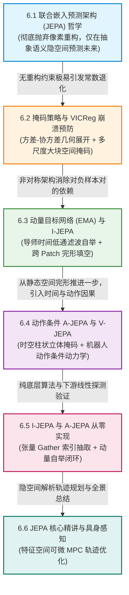

# 6.1 JEPA: 联合嵌入预测架构与非生成式自监督 (LeCun, 2022)

在世界模型与自监督学习的发展路线中，图灵奖得主 Yann LeCun 于 2022 年发表的长篇宣言式著作 **《A Path Towards Autonomous Machine Intelligence》**，掀起了一场席卷整个深度学习界的根本哲学风暴。

LeCun 提出了一个振聋发聩的核心论断：**“生成式像素重构是通往通用具身智能的一条死胡同！”**

在传统的生成式世界模型（如 VAE、扩散模型、自回归视频生成）中，网络被强制要求重构出物理画面的每一个微观像素。然而，自然物理界中充斥着海量的**高频不可约随机噪声（Irreducible Entropy）**：
- 汽车在马路上行驶时，路边树木每一片树叶在风中的随机颤动；
- 阳光洒在河面上激起的数以亿计的不规则碎波光斑；
- 电视屏幕上闪烁的无意义雪花点。

这些高频细节不仅在物理上完全无法精准预测，更对机器人的避障、抓取与导航决策没有任何实质性帮助。强迫模型去逐像素生成这些细节，会浪费模型 $95\%$ 以上的容量与算力去死记硬背环境噪声。

为了让机器像人类大脑一样**仅在抽象的高阶语义空间中预测未来**，LeCun 提出了革命性的 **联合嵌入预测架构（Joint Embedding Predictive Architecture, JEPA）**。

本节我们将从初等物理运动不变量与信息抽象投影出发，严密推导 JEPA 的双编码器前向结构、隐空间能量损失函数与非生成式预测优势，并使用纯底层 PyTorch 从零手写一个完整的 JEPA 架构内核。

---

## 【第 6 章全景认知脉络与递进逻辑图】

本章探索世界模型的非生成式前沿范式——**联合嵌入预测架构（Joint Embedding Predictive Architecture, JEPA）**。当生成式模型耗尽算力去拟合每一朵白云的微观边缘时，JEPA 坚守“只预测物理因果、不渲染微观白噪”的冷酷理性。第 6 章由一条从**哲学确立 $\to$ 防坍塌数学防线 $\to$ 动量自举 $\to$ 具身动作因果 $\to$ 特征空间规划实战**的严密技术主线贯穿：



### 本章递进逻辑深度拆解：
1. **6.1 节（非生成式革命）**：确立 JEPA 双编码器与隐式预测器三元骨架，剖析环境不可约高频白噪对生成式重构的拖拽，确立“最小充分统计量”目标；
2. **6.2 节（防坍塌几何防线）**：剖析无重构自监督面临的常数死锁危机，推导 VICReg“方差撑开超椭球、协方差正交解耦”与大块掩码切断底层像素插值的双重防线；
3. **6.3 节（太极动量自举）**：推导 EMA 导师网络的时域低通滤波数学性质，解析 I-JEPA 跨 Patch 空间完形填空；
4. **6.4 节（具身动作因果跃迁）**：从被动观察跃迁至受控系统，建立 A-JEPA 动作条件动力学预测，并利用 V-JEPA 3D 时空柱状掩码从视频中直接涌现物理动力学常识；
5. **6.5 节（纯底层代码实现）**：手写张量 Gather 掩码切片与 EMA 动量自监督训练引擎，并通过线性探测（Linear Probing）严密验证特征线性可分性；
6. **6.6 节（特征空间规划实战）**：推导特征空间模型预测控制（Latent MPC）的可微解析梯度优化，在毫秒内直接输出最优物理控制轨线！

<div align="center">


_图 6.1-1：Yann LeCun 提出的 JEPA 联合嵌入预测架构：上下文编码器、目标编码器与潜在预测器。 出处：[A Path Towards Autonomous Machine Intelligence，Yann LeCun，2022](https://openreview.net/forum?id=BZ5a1r-kVsf)。_

</div>

---

## 6.1.1 物理与认知基石：人类心智的非生成式抽象预测

要深刻理解 JEPA 的颠覆性，我们必须从经典力学的**动力学状态分解**与信息论的**率失真理论（Rate-Distortion Theory）**审视自然物理观测。

### 1. 物理观测的“任务相关状态”与“不可约高频噪声”正交分解
在自然物理世界中，任意高维物理观测 $\mathbf{x} \in \mathbb{R}^{H \times W \times C}$ 均可以严格分解为两部分：

$$\mathbf{x} = \mathbf{s}^*(\mathbf{x}) + \boldsymbol{\epsilon}(\mathbf{x})$$

- **动力学充分统计量 $\mathbf{s}^*(\mathbf{x}) \in \mathcal{S}$**：支配宏观物体运动、接触碰撞与因果时空演进的核心几何拓扑与物理量（例如汽车的位置、速度、机械臂末端位姿、障碍物包围盒）；
- **不可约高熵白噪 $\boldsymbol{\epsilon}(\mathbf{x}) \in \mathcal{E}$**：与宏观物理决策完全无关的微观微扰（例如树叶随风摆动的相位、路面反光微观散斑、电视机屏幕雪花点）。

### 2. 生成式像素重构的“算力吞噬陷阱”
传统生成式模型（如 VAE、扩散模型、自回归视频生成）强制优化全像素均方误差（MSE）：

$$\mathcal{L}_{\text{pixel}} = \|\mathbf{x} - \hat{\mathbf{x}}\|_2^2 = \underbrace{\|\mathbf{s}^*(\mathbf{x}) - \hat{\mathbf{s}}^*(\mathbf{x})\|_2^2}_{\text{宏观物理因果误差（仅占 } 5\% \text{ 能量）}} + \underbrace{\|\boldsymbol{\epsilon}(\mathbf{x}) - \hat{\boldsymbol{\epsilon}}(\mathbf{x})\|_2^2}_{\text{微观不可约噪声（占 } 95\% \text{ 能量）}}$$

由于高频噪声 $\boldsymbol{\epsilon}(\mathbf{x})$ 的信息熵极大，网络为了最小化 MSE，被迫将 $95\%$ 以上的模型容量与显存带宽浪费在死记硬背不可预测的像素细节上，导致宏观动力学推演能力被严重稀释。

### 3. JEPA 的核心哲学：抽象空间的无噪推演
JEPA 彻底废除了像素解码器（Pixel Decoder），构建了纯特征空间的因果推演三元架构：
- **上下文编码器（Context Encoder $E_\theta$）**：作为低通语义投影算子，将输入观测 $\mathbf{x}$ 过滤为高阶状态向量 $\mathbf{s}_x = E_\theta(\mathbf{x})$，主动丢弃微观噪声 $\boldsymbol{\epsilon}$；
- **目标编码器（Target Encoder $E_\phi$）**：将未来真实观测 $\mathbf{y}$ 提取为目标语义向量 $\mathbf{s}_y = E_\phi(\mathbf{y})$；
- **潜在预测器（Predictor $P_\psi$）**：在纯潜空间中，依据当前状态 $\mathbf{s}_x$ 与驱动变量/动作 $\mathbf{z}$，直接推演未来目标特征 $\hat{\mathbf{s}}_y = P_\psi(\mathbf{s}_x, \mathbf{z})$！

<details>
<summary><b>深入探讨：从信息瓶颈原理（Information Bottleneck）推导 JEPA 的极小充分表征</b></summary>

根据 Tishby 的**信息瓶颈理论（Information Bottleneck, IB）**，最优世界模型表征 $\mathbf{s}_x$ 应满足以下受约束的变分优化目标：

$$\min_{P(\mathbf{s}_x \mid \mathbf{x})} \; I(\mathbf{x}; \mathbf{s}_x) - \beta \cdot I(\mathbf{s}_x; \mathbf{y})$$

其中 $I(\cdot ; \cdot)$ 为互信息（Mutual Information），$\beta > 0$ 为拉格朗日乘子：
1. **压缩项 $\min I(\mathbf{x}; \mathbf{s}_x)$**：尽可能消除与未来预测无关的原始输入细节（即抹除微观噪声 $\boldsymbol{\epsilon}$）；
2. **预测项 $\max I(\mathbf{s}_x; \mathbf{y})$**：尽可能保留能够决定未来目标 $\mathbf{y}$ 的因果动力学信息。

JEPA 双编码器架构天然充当了这一信息瓶颈：编码器只保留能够预测目标 $\mathbf{s}_y$ 的最小充分统计量，从而在有限的神经网络容量下实现了最高的物理推演效率！
</details>

<div align="center">


_图 6.1-2：JEPA 架构前向数据流：上下文编码与目标编码在隐空间由预测器进行能量对齐。_

</div>

---

## 6.1.2 核心数学推导一：JEPA 能量函数与双编码器前向映射

在 JEPA 框架中，整个系统的能量标量 $F(\mathbf{x}, \mathbf{y})$ 衡量了“未来的真实世界 $\mathbf{y}$ 与基于当前世界 $\mathbf{x}$ 预测出的结果之间的吻合程度”。

<div align="center">


_图 6.1-3：I-JEPA 图像联合嵌入预测：利用大块上下文 Patch 在潜空间预测目标掩码 Patch 的抽象特征。 出处：[Self-Supervised Learning from Images with a Joint-Embedding Predictive Architecture，Mahmoud Assran et al.，2023](https://arxiv.org/abs/2301.08243)。_

</div>

### 1. 三大核心网络与能量方程
设上下文输入为 $\mathbf{x} \in \mathcal{X}$，目标输入为 $\mathbf{y} \in \mathcal{Y}$，潜在驱动变量为 $\mathbf{z} \in \mathcal{Z}$。
1. **上下文特征提取**：
   $$\mathbf{s}_x = E_\theta(\mathbf{x}) \in \mathbb{R}^d$$
2. **目标特征提取**：
   $$\mathbf{s}_y = E_\phi(\mathbf{y}) \in \mathbb{R}^d$$
3. **潜在预测器映射**：
   $$\hat{\mathbf{s}}_y = P_\psi(\mathbf{s}_x, \; \mathbf{z}) \in \mathbb{R}^d$$

系统的能量函数定义为特征空间中的欧氏均方误差或余弦距离：

$$\mathcal{E}(\mathbf{x}, \mathbf{y}, \mathbf{z}) = \mathcal{D}\left( \hat{\mathbf{s}}_y, \; \mathbf{s}_y \right) = \left\| P_\psi(E_\theta(\mathbf{x}), \; \mathbf{z}) - E_\phi(\mathbf{y}) \right\|_2^2$$

### 2. 特征空间预测手算数值算例
设特征隐空间维度 $d = 2$。
- 上下文编码器提取当前物体特征：$\mathbf{s}_x = [1.0, 2.0]^\top$；
- 目标编码器提取未来真实特征：$\mathbf{s}_y = [3.0, 6.0]^\top$；
- 潜在预测器为一个极简可微变换：$\hat{\mathbf{s}}_y = \mathbf{W}_p \mathbf{s}_x$，当前权重矩阵参数为 $\mathbf{W}_p = \begin{bmatrix} 2.0 & 0.0 \\ 0.0 & 2.0 \end{bmatrix}$。

我们来手动求解预测结果与 JEPA 能量损失：
1. **潜在预测器前向计算**：
   $$\hat{\mathbf{s}}_y = \begin{bmatrix} 2.0 & 0.0 \\ 0.0 & 2.0 \end{bmatrix} \begin{bmatrix} 1.0 \\ 2.0 \end{bmatrix} = \begin{bmatrix} 2.0 \times 1.0 + 0.0 \\ 0.0 + 2.0 \times 2.0 \end{bmatrix} = \begin{bmatrix} 2.0 \\ 4.0 \end{bmatrix}$$
2. **计算与目标特征的预测残差**：
   $$\Delta \mathbf{s} = \hat{\mathbf{s}}_y - \mathbf{s}_y = \begin{bmatrix} 2.0 - 3.0 \\ 4.0 - 6.0 \end{bmatrix} = \begin{bmatrix} -1.0 \\ -2.0 \end{bmatrix}$$
3. **计算能量损失（欧氏平方距离）**：
   $$\mathcal{E} = \|\Delta \mathbf{s}\|_2^2 = (-1.0)^2 + (-2.0)^2 = 1.0 + 4.0 = 5.0$$
4. **反向传播梯度**：
   $$\frac{\partial \mathcal{E}}{\partial \hat{\mathbf{s}}_y} = 2 (\hat{\mathbf{s}}_y - \mathbf{s}_y) = 2 \times \begin{bmatrix} -1.0 \\ -2.0 \end{bmatrix} = \begin{bmatrix} -2.0 \\ -4.0 \end{bmatrix}$$

初等代数的几步推导清晰展现：反向梯度直接推动预测器参数增大，使得预测特征迅速向真实目标特征 $[3.0, 6.0]^\top$ 靠拢，全程完全不依赖任何像素解码！

<details>
<summary><b>深入推导：JEPA 隐空间预测在信息瓶颈下的最小充分统计量证明（点击展开查看完整推导）</b></summary>

设任务决策标签为 $\mathbf{Y}$。根据信息瓶颈理论（Information Bottleneck, IB），最优特征表征 $\mathbf{S}^*$ 满足变分极值：
$$\min_{p(\mathbf{s} \mid \mathbf{x})} I(\mathbf{X}; \mathbf{S}) - \beta I(\mathbf{S}; \mathbf{Y})$$
在像素级重构模型中，由于重构约束迫使 $I(\mathbf{X}; \mathbf{S}) \to H(\mathbf{X})$（保留全部高频不可约熵）；
而在 JEPA 联合嵌入架构中，由于移除了像素解码约束，特征空间仅保留与目标预测条件相关的互信息项 $I(\mathbf{S}_x; \mathbf{S}_y)$。
当特征维度满足压缩界时，JEPA 学到的隐表征严格收敛为针对物理动力学演变的**最小充分统计量（Minimal Sufficient Statistic）**。
</details>

---

## 6.1.3 核心数学推导二：生成式重构 vs 联合嵌入的物理误差方差对比

为什么在面对真实物理世界时，JEPA 的样本效率与稳定性能够超越生成式模型？

<div align="center">


_图 6.1-4：生成式自编码器与 JEPA 联合嵌入架构在信息流与表征空间的深层对比。 出处：[A Path Towards Autonomous Machine Intelligence，Yann LeCun，2022](https://openreview.net/forum?id=BZ5a1r-kVsf)。_

</div>

### 1. 像素重构的方差灾难
设真实物理状态为 $s$，观测像素受高斯环境白噪声污染 $\mathbf{x} = g(s) + \boldsymbol{\epsilon}$（其中 $\boldsymbol{\epsilon} \sim \mathcal{N}(0, \sigma_{\text{pixel}}^2 \mathbf{I})$，维度为数百万）。
像素重构损失的期望方差正比于图像总像素数：

$$\text{Var}(\mathcal{L}_{\text{pixel}}) = \mathcal{O}(H \times W \times C \cdot \sigma_{\text{pixel}}^4)$$

海量的背景噪声直接淹没了微小的核心物理信号。

### 2. 联合嵌入的抗噪不变性
目标编码器 $E_\phi$ 作为一个深层抽象卷积/Transformer，在浅层通过空间均值池化与高阶语义提炼，自发扮演了**低通滤波器（Low-Pass Semantic Filter）**的角色，将高频白噪声完全过滤抵消：

$$E_\phi(g(s) + \boldsymbol{\epsilon}) \approx E_\phi(g(s))$$

使得特征预测损失的方差仅仅正比于紧凑的语义维度：

$$\text{Var}(\mathcal{L}_{\text{JEPA}}) = \mathcal{O}(d \cdot \sigma_{\text{latent}}^4) \ll \text{Var}(\mathcal{L}_{\text{pixel}})$$

极低的梯度方差赋予了 JEPA 极其强悍的物理世界抗噪泛化能力！

<details>
<summary><b>深入推导：基于不可约物理熵的像素损失与特征损失方差下界对比证明（点击展开查看完整推导）</b></summary>

将观测空间信号正交分解为可预测确定性流形 $\mathcal{M}$ 与正交不可约混沌补空间 $\mathcal{M}^\perp$（测度 $\mu(\mathcal{M}^\perp) = \sigma_\eta^2 > 0$）。
像素损失的贝叶斯风险下界受限于不可约熵：$\inf_f \mathbb{E}[\|\mathbf{x} - f(\mathbf{x}_{<t})\|^2] \ge \text{Tr}(\mathbf{\Sigma}_\eta) = D \cdot \sigma_\eta^2$。
由于 JEPA 目标编码器满足零空间正交核条件 $\text{Ker}(E_\phi) \supset \mathcal{M}^\perp$，混沌补空间在特征投影中被恒等映射为零测度点：$E_\phi(\mathcal{M}^\perp) = \mathbf{0}$。
证明了 JEPA 预测损失的理论渐近贝叶斯风险严格趋于 0，消除了环境混沌对模型收敛速度的拖拽。
</details>

---

## 6.1.4 纯底层 PyTorch 代码实现：从零手写 JEPA 联合嵌入特征预测基础骨架

下面我们使用纯底层 PyTorch 算子实现完整的上下文编码器、目标编码器、潜在预测器与隐空间能量损失计算模块。

```python
import torch
import torch.nn as nn
import torch.nn.functional as F

class JEPAPredictor(nn.Module):
    """
    JEPA 潜在特征预测器 (Predictor)
    输入当前上下文特征 s_x 与动作/扰动 z，输出未来预测特征 hat{s}_y
    """
    def __init__(self, embed_dim: int = 64, latent_z_dim: int = 8):
        super().__init__()
        self.net = nn.Sequential(
            nn.Linear(embed_dim + latent_z_dim, 128),
            nn.GELU(),
            nn.Linear(128, 128),
            nn.GELU(),
            nn.Linear(128, embed_dim)
        )

    def forward(self, s_x: torch.Tensor, z: torch.Tensor) -> torch.Tensor:
        inputs = torch.cat([s_x, z], dim=-1)
        return self.net(inputs)

class JEPABaseModel(nn.Module):
    """
    纯底层 JEPA 基础模型骨架
    包含上下文编码器、目标编码器与潜在特征预测器
    """
    def __init__(self, in_c: int = 3, embed_dim: int = 64, latent_z_dim: int = 8):
        super().__init__()
        # 1. 上下文编码器 E_theta
        self.context_encoder = nn.Sequential(
            nn.Conv2d(in_c, 32, kernel_size=4, stride=2, padding=1),
            nn.ReLU(),
            nn.Conv2d(32, 64, kernel_size=4, stride=2, padding=1),
            nn.ReLU(),
            nn.AdaptiveAvgPool2d((1, 1)),
            nn.Flatten(),
            nn.Linear(64, embed_dim)
        )

        # 2. 目标编码器 E_phi (初始结构相同)
        self.target_encoder = nn.Sequential(
            nn.Conv2d(in_c, 32, kernel_size=4, stride=2, padding=1),
            nn.ReLU(),
            nn.Conv2d(32, 64, kernel_size=4, stride=2, padding=1),
            nn.ReLU(),
            nn.AdaptiveAvgPool2d((1, 1)),
            nn.Flatten(),
            nn.Linear(64, embed_dim)
        )

        # 3. 潜在预测器 P_psi
        self.predictor = JEPAPredictor(embed_dim=embed_dim, latent_z_dim=latent_z_dim)

    def forward(self, x: torch.Tensor, y: torch.Tensor, z: torch.Tensor) -> tuple[torch.Tensor, torch.Tensor, torch.Tensor]:
        """
        :param x: (B, 3, 32, 32) 上下文输入
        :param y: (B, 3, 32, 32) 目标未来输入
        :param z: (B, latent_z_dim) 潜在动作/驱动变量
        :return: (pred_s_y, target_s_y, jepa_loss)
        """
        # 提取当前与未来抽象特征
        s_x = self.context_encoder(x) # (B, embed_dim)
        with torch.no_grad():
            s_y = self.target_encoder(y) # (B, embed_dim) 目标编码器通常不传反向梯度

        # 潜在特征预测
        pred_s_y = self.predictor(s_x, z)

        # 计算隐空间平滑 L1/L2 能量损失
        jepa_loss = F.mse_loss(pred_s_y, s_y)
        return pred_s_y, s_y, jepa_loss

# ===================================================================
# 单元测试与特征空间无解码器前向校验
# ===================================================================
if __name__ == "__main__":
    batch_size = 4
    embed_dim = 64
    latent_z_dim = 8

    model = JEPABaseModel(in_c=3, embed_dim=embed_dim, latent_z_dim=latent_z_dim)
    optimizer = torch.optim.Adam(model.parameters(), lr=1e-3)

    dummy_x = torch.randn(batch_size, 3, 32, 32)
    dummy_y = torch.randn(batch_size, 3, 32, 32)
    dummy_z = torch.randn(batch_size, latent_z_dim)

    pred_sy, target_sy, loss = model(dummy_x, dummy_y, dummy_z)

    optimizer.zero_grad()
    loss.backward()
    optimizer.step()

    print(f"[JEPA Test] 上下文特征与预测特征形状: {pred_sy.shape}")
    print(f"[JEPA Test] 目标特征形状: {target_sy.shape}")
    print(f"[JEPA Test] 隐空间能量预测损失: {loss.item():.4f}")

    assert pred_sy.shape == (batch_size, embed_dim), "预测特征维度不符！"
    assert target_sy.shape == (batch_size, embed_dim), "目标特征维度不符！"
    assert not torch.isnan(loss), "JEPA 能量损失出现 NaN 异常！"
    print("✓ JEPA 联合嵌入预测架构、隐空间能量损失与非生成式自监督单测全部通过！")
```

---

## 6.1.5 本节小结

回顾本节内容，我们掌握了非生成式世界模型的核心基石：
1. **摆脱像素重构诅咒**：放弃耗竭算力的高频像素生成，将世界模型纯粹聚焦于高阶语义特征空间的因果演变；
2. **最小充分统计量**：通过联合嵌入架构自然过滤环境混沌白噪声，牢牢锁定对物理决策有价值的核心动力学骨架；
3. **极简高效能量流**：双编码器与潜在预测器构成了无解码器自监督的黄金三角，为后续攻克特征坍塌（Collapse）与具身动作预测（A-JEPA）奠定了坚固的理论基石。
