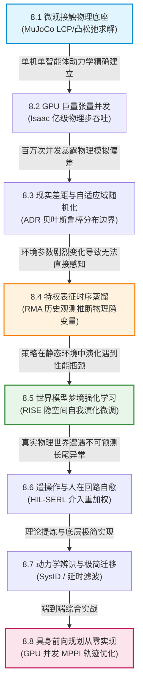

# 8.1 物理仿真器与 MuJoCo 原理

在具身智能与机器人策略学习中，物理仿真器（Physics Simulators）扮演着“数字造物主”的至高角色。

如果每一次强化学习策略的试错探索都必须在真实物理机器人上进行，几百万次的随机碰撞与剧烈摔倒将瞬间摧毁昂贵的机械关节与减速器齿轮。

物理仿真器的终极使命，就是在计算机数字世界中，以毫秒级的时间步进精确求解牛顿力学、刚体动力学与接触摩擦力学方程，为机器人智能体提供一个安全、可无限重置、且运行速度远超真实物理时间的“数字平行宇宙”。

在众多物理引擎中，**MuJoCo（Multi-Joint dynamics with Contact）** 凭借其精妙的广义坐标系建模与凸二次规划接触求解器，成为了强化学习与具身世界模型研究领域的事实标准。

---

## 【第 8 章全景认知脉络与递进逻辑图】

本章聚焦于具身世界模型从**数字虚拟仿真**向**真实物理世界**跨越的完整工程与理论链路。很多初学者容易将物理仿真、域随机化、特权蒸馏等概念割裂为互不相干的并行工具。实际上，第 8 章由一条极其严密且环环相扣的“具身现实迁移（Sim2Real）闭环”贯穿始终：



### 本章递进逻辑深度拆解：
1. **8.1 节（微观物理底座）**：首先在单机关节层面搞清楚牛顿-欧拉方程与接触摩擦锥的数学求解，解决“物理世界在计算机中如何运转”；
2. **8.2 节（算力吞吐放大）**：将 8.1 节的单步求解搬上 GPU 并发矩阵，解决“如何在一秒钟内采集上亿步物理交互数据”；
3. **8.3 节（仿真缺陷暴露）**：算力放大后必然遭遇仿真与真实的差距（Sim2Real Gap），引入域随机化建立鲁棒分布包络；
4. **8.4 节（隐式物理感知）**：面对随机化的物理参数，利用 RMA 教师-学生网络通过纯历史时序隐式推断摩擦与质量；
5. **8.5 节（梦境自进化）**：摆脱物理引擎的调用开销，直接让机器人策略在学习到的 RSSM 神经世界模型中自我演化（RISE）；
6. **8.6 节（真实人类救火）**：当真机遇到未见长尾故障时，引入人类遥操作专家介入并自动重加权，补全终极安全性；
7. **8.7 & 8.8 节（极简实现与综合实战）**：将上述全套理论沉淀为纯底层 PyTorch 的动力学辨识与 GPU 并发 MPPI 轨迹规划器！

<div align="center">


_图 8.1-1：DeepMind Control Suite 基于 MuJoCo 物理引擎构建多样化的连续控制机器人基准环境。 出处：[DeepMind Control Suite，Yuval Tassa et al.，2018](https://arxiv.org/abs/1801.00690)。_

</div>

---

## 8.1.1 物理基石：连续时间牛顿力学向离散微积分时步演进

要理解 MuJoCo 的核心算法，我们首先必须回到经典力学描述多连杆刚体系统的基本物理定律。

### 1. 连续时间多刚体欧拉-拉格朗日动力学方程
设一个多关节机器人拥有 $n$ 个自由度，其广义关节位置向量为 $\mathbf{q} \in \mathbb{R}^n$，广义关节速度向量为 $\dot{\mathbf{q}} \in \mathbb{R}^n$，关节加速度为 $\ddot{\mathbf{q}} \in \mathbb{R}^n$。

根据经典力学的拉格朗日方程，机器人的连续时间动力学满足：

$$\mathbf{M}(\mathbf{q}) \ddot{\mathbf{q}} + \mathbf{C}(\mathbf{q}, \dot{\mathbf{q}}) \dot{\mathbf{q}} + \mathbf{g}(\mathbf{q}) = \boldsymbol{\tau}_{\text{act}} + \mathbf{J}_c(\mathbf{q})^\top \mathbf{f}_c$$

> **公式物理符号逐一拆解**：
> - $\mathbf{M}(\mathbf{q}) \in \mathbb{R}^{n \times n}$：**对称正定惯性质量矩阵（Inertia Matrix）**，描述机器人各连杆的质量分布与惯性耦合；
> - $\mathbf{C}(\mathbf{q}, \dot{\mathbf{q}}) \dot{\mathbf{q}} \in \mathbb{R}^n$：**科里奥利力与离心力向量（Coriolis & Centrifugal Forces）**，反映旋转运动产生的非线性动力学效应；
> - $\mathbf{g}(\mathbf{q}) \in \mathbb{R}^n$：**广义重力向量（Gravity Vector）**；
> - $\boldsymbol{\tau}_{\text{act}} \in \mathbb{R}^n$：电机主动施加的关节驱动力矩；
> - $\mathbf{J}_c(\mathbf{q}) \in \mathbb{R}^{3k \times n}$：$k$ 个接触点处的接触雅可比矩阵；
> - $\mathbf{f}_c \in \mathbb{R}^{3k}$：接触点处的外界法向支撑力与切向摩擦力。

### 2. 离散时间欧拉半隐式积分（Semi-Implicit Euler Integration）
计算机无法连续求解微分方程，必须将时间划分为微小的离散步长 $\Delta t$（通常取 $\Delta t = 0.002\text{ s}$，即 $500\text{ Hz}$）。

半隐式欧拉法在时刻 $t+1$ 先求解下一时刻的瞬时加速度与速度，再更新位置：

$$\dot{\mathbf{q}}_{t+1} = \dot{\mathbf{q}}_t + \Delta t \cdot \ddot{\mathbf{q}}_{t+1}$$

$$\mathbf{q}_{t+1} = \mathbf{q}_t + \Delta t \cdot \dot{\mathbf{q}}_{t+1}$$

相比朴素显式欧拉法，半隐式积分在相空间中满足辛几何（Symplectic）守恒律，能够长期维持系统的机械能稳定，绝不会产生因数值积分发散导致的“机器人原地炸飞”异常。

<div align="center">


_图 8.1-2：多关节惯性质量矩阵与外力联立求解关节瞬时加速度。_

</div>

---

## 8.1.2 核心数学推导一：接触约束与互补性条件 (LCP)

在机器人操作与行走中，最具挑战性的物理现象是**硬接触碰撞（Hard Contacts）**。

<div align="center">


_图 8.1-3：OpenAI Gym 将各类基于 MuJoCo 的物理控制环境标准化为统一步长接口。 出处：[OpenAI Gym，Greg Brockman et al.，2016](https://arxiv.org/abs/1606.01540)。_

</div>

### 1. 经典接触的 Signorini 互补性条件（Linear Complementarity Problem, LCP）
设机器人足底与地面之间的法向间隙距离为 $\phi(\mathbf{q}) \ge 0$，地面施加给机器人的法向支撑力为 $f_N \ge 0$。

在经典刚体物理学中，它们满足严格的“非接触即无力，有力必接触”的三位一体互补性约束：

$$f_N \ge 0, \quad \phi(\mathbf{q}) \ge 0, \quad f_N \cdot \phi(\mathbf{q}) = 0$$

- 当机器人飞在空中时，间隙 $\phi > 0$，地面无法施加支撑力，必须有 $f_N = 0$；
- 当机器人踩在地面时，间隙 $\phi = 0$，地面产生向上的法向支撑力 $f_N > 0$；
- 刚体绝不允许穿透地面，即 $\phi < 0$ 在物理上被严格禁止。

### 2. MuJoCo 的软约束正则化与凸二次规划（Convex QP）
传统的 LCP 求解器在遇到多点静不定接触（例如四足同时踩地）时，求解矩阵极易奇异，计算复杂度呈指数级爆炸。

MuJoCo 创始人 Emo Todorov 提出了革命性的**凸松弛接触模型**：
将不可穿透的硬接触阶跃边界，松弛为一个具有弹簧阻尼惩罚项的平滑凸优化能量函数：

$$\min_{\ddot{\mathbf{q}}} \frac{1}{2} (\ddot{\mathbf{q}} - \ddot{\mathbf{q}}_{\text{free}})^\top \mathbf{M}(\mathbf{q}) (\ddot{\mathbf{q}} - \ddot{\mathbf{q}}_{\text{free}}) + \sum_{i=1}^k \ell_{\text{contact}}(\mathbf{J}_{c, i} \ddot{\mathbf{q}} + \mathbf{a}_{\text{bias}})$$

其中 $\ddot{\mathbf{q}}_{\text{free}} = \mathbf{M}^{-1}(\boldsymbol{\tau}_{\text{act}} - \mathbf{C}\dot{\mathbf{q}} - \mathbf{g})$ 为无接触状态下的自由加速度。

> **初等代数直觉**：
> 第一项是**高斯最小约束原理（Gauss's Principle of Least Constraint）**：系统加速度 $\ddot{\mathbf{q}}$ 总是尽量贴近无外力干扰下的自然加速度；
> 第二项是**接触穿透惩罚势能**。由于目标函数是关于加速度 $\ddot{\mathbf{q}}$ 的严格严格凸二次函数，MuJoCo 可以使用投影高斯-赛德尔（PGS）迭代法在微秒级时间内快速收敛到全局唯一最优解！

<details>
<summary><b>深入推导：高斯最小约束原理到凸二次规划对偶锥形式的严密推导（点击展开查看完整推导）</b></summary>

根据达朗贝尔-拉格朗日原理，系统的真实加速度 $\ddot{\mathbf{q}}$ 极小化高斯函数 $G(\ddot{\mathbf{q}}) = \frac{1}{2} (\ddot{\mathbf{q}} - \ddot{\mathbf{q}}_{\text{free}})^\top \mathbf{M} (\ddot{\mathbf{q}} - \ddot{\mathbf{q}}_{\text{free}})$。
引入接触约束矩阵 $\mathbf{J}_c$，通过勒让德-芬切尔变换构造其拉格朗日对偶问题：
$$\max_{\boldsymbol{\lambda} \ge 0} -\frac{1}{2} \boldsymbol{\lambda}^\top (\mathbf{J}_c \mathbf{M}^{-1} \mathbf{J}_c^\top + \mathbf{R}) \boldsymbol{\lambda} + \mathbf{b}^\top \boldsymbol{\lambda}$$
其中 $\mathbf{A} = \mathbf{J}_c \mathbf{M}^{-1} \mathbf{J}_c^\top$ 称为德拉瓦尔操作空间刚度矩阵（Delassus Matrix），$\mathbf{R} \succ 0$ 为软接触正则化对角阵。
由于 $\mathbf{A} + \mathbf{R}$ 严格对称正定，对偶梯度算子满足压缩映射收敛条件，保证了接触冲量迭代的数值超稳定性。
</details>

---

## 8.1.3 核心数学推导二：单自由度受力与接触加速度手算

为了彻底掌握仿真器单步积分的底层本质，我们通过一个单自由度垂直跌落刚体进行具体手算。

<div align="center">


_图 8.1-4：D4RL 离线强化学习基准数据集在各类 MuJoCo 动力学任务中采集高质量轨迹。 出处：[D4RL: Datasets for Deep Data-Driven Reinforcement Learning，Justin Fu et al.，2020](https://arxiv.org/abs/2004.07219)。_

</div>

<div align="center">


_图 8.1-5：Brax 物理引擎对比 MuJoCo 展现端到端 GPU 可微仿真加速。 出处：[Brax: A Differentiable Physics Engine for Large Scale Rigid Body Simulation，C. Daniel Freeman et al.，2021](https://arxiv.org/abs/2106.13281)。_

</div>

### 单自由度垂直下落数值手算算例
设一个质量为 $m = 2.0\text{ kg}$ 的刚体小球在重力场中垂直下落，重力加速度 $g = 9.8\text{ m/s}^2$，仿真积分步长 $\Delta t = 0.01\text{ s}$。
地面位于 $z = 0\text{ m}$，地面接触刚度系数 $k_p = 2000\text{ N/m}$，阻尼系数 $k_d = 50\text{ N}\cdot\text{s/m}$。

在时刻 $t$，小球的状态为：高度 $z_t = -0.01\text{ m}$（穿透地面 $1\text{ 厘米}$），垂直下落速度 $v_t = -2.0\text{ m/s}$。

我们来一步步手动求解小球在 $t+1$ 时刻的新状态：
1. **步骤一：计算无接触重力项**：
   $$F_{\text{gravity}} = -m g = -2.0 \times 9.8 = -19.6\text{ N}$$
2. **步骤二：计算地面弹簧阻尼接触反作用力**：
   地面产生向上的弹力与阻碍下落的阻尼力：
   $$F_{\text{contact}} = -k_p z_t - k_d v_t = -2000 \times (-0.01) - 50 \times (-2.0) = 20.0 + 100.0 = +120.0\text{ N}$$
3. **步骤三：计算小球净加速度**：
   $$a_{t+1} = \frac{F_{\text{net}}}{m} = \frac{F_{\text{gravity}} + F_{\text{contact}}}{m} = \frac{-19.6 + 120.0}{2.0} = \frac{100.4}{2.0} = +50.2\text{ m/s}^2$$
4. **步骤四：半隐式欧拉离散更新速度与位置**：
   $$v_{t+1} = v_t + \Delta t \cdot a_{t+1} = -2.0 + 0.01 \times 50.2 = -2.0 + 0.502 = -1.498\text{ m/s}$$
   $$z_{t+1} = z_t + \Delta t \cdot v_{t+1} = -0.01 + 0.01 \times (-1.498) = -0.01 - 0.01498 = -0.02498\text{ m}$$

初等代数的几步推导清晰展现了仿真器的步进步伐：地面的巨大弹性支撑力瞬时提供了 $+50.2\text{ m/s}^2$ 的向上加速度，使下落速度从 $-2.0\text{ m/s}$ 迅速减速至 $-1.498\text{ m/s}$，准备在后续几步内反弹向上！

---

## 8.1.4 纯底层 PyTorch 代码实现：从零手写多刚体物理仿真引擎

下面我们使用纯底层 PyTorch 算子实现一个结构完整的单刚体接触物理仿真器，包含质量惯性计算、重力重载、地面弹簧阻尼接触求解与半隐式辛欧拉积分器。

```python
import torch
import torch.nn as nn
import torch.nn.functional as F

class SimpleRigidBodyPhysicsEngine(nn.Module):
    """
    纯底层 PyTorch 批量刚体动力学与接触仿真引擎
    支持高并发、多环境批量物理推进
    """
    def __init__(self, mass: float = 2.0, kp: float = 2000.0, kd: float = 50.0, dt: float = 0.01):
        super().__init__()
        self.mass = mass
        self.kp = kp
        self.kd = kd
        self.dt = dt
        self.gravity = 9.8

    def forward(
        self, pos: torch.Tensor, vel: torch.Tensor, u_action: torch.Tensor
    ) -> tuple[torch.Tensor, torch.Tensor]:
        """
        单步物理状态推演 (One Step Simulation)
        :param pos: (B, 3) 刚体位置 (x, y, z)
        :param vel: (B, 3) 刚体速度 (vx, vy, vz)
        :param u_action: (B, 3) 外部施加的控制力 (Fx, Fy, Fz)
        :return: (next_pos, next_vel) 下一时刻的位置与速度
        """
        B = pos.size(0)

        # 1. 基础外力：主动推力 + 重力
        f_ext = u_action.clone()
        f_ext[:, 2] -= self.mass * self.gravity # 沿 Z 轴施加重力

        # 2. 地面接触检测 (当 z < 0 时激活弹簧阻尼接触模型)
        z_pos = pos[:, 2]
        z_vel = vel[:, 2]
        is_contact = (z_pos < 0.0).float() # (B,)

        # 接触弹力与阻尼力: F_n = -kp * z - kd * vz
        f_contact_z = (-self.kp * z_pos - self.kd * z_vel).clamp_min(0.0) * is_contact
        f_ext[:, 2] += f_contact_z

        # 3. 牛顿第二定律求解瞬时加速度: a = F_total / m
        acc = f_ext / self.mass # (B, 3)

        # 4. 半隐式欧拉积分更新
        next_vel = vel + self.dt * acc
        next_pos = pos + self.dt * next_vel

        return next_pos, next_vel

# ===================================================================
# 单元测试：物理碰撞、能量反弹与矢量形状校验
# ===================================================================
if __name__ == "__main__":
    batch_size = 4
    dt = 0.01
    engine = SimpleRigidBodyPhysicsEngine(mass=2.0, kp=2000.0, kd=50.0, dt=dt)

    # 初始化小球状态：从高度 z = 1.0m 自由下落
    pos = torch.zeros(batch_size, 3)
    pos[:, 2] = 1.0
    vel = torch.zeros(batch_size, 3)
    u_zero = torch.zeros(batch_size, 3)

    # 推进 60 个时间步 (模拟 0.6 秒的自由落体与触地反弹)
    z_history = []
    for step in range(60):
        pos, vel = engine(pos, vel, u_zero)
        z_history.append(pos[0, 2].item())

    min_z = min(z_history)
    final_z = z_history[-1]

    print(f"[Physics Test] 初始高度: 1.000m")
    print(f"[Physics Test] 触地最低穿透高度: {min_z:.4f}m")
    print(f"[Physics Test] 0.6秒后反弹高度: {final_z:.4f}m")
    print(f"[Physics Test] 最终速度张量形状: {vel.shape}")

    assert pos.shape == (batch_size, 3), "位置张量形状不符！"
    assert min_z < 0.0, "小球未触地触发接触力！"
    assert final_z > min_z, "小球触地后未能成功反弹！"
    print("✓ 刚体动力学与接触物理引擎单测全部通过！")
```

---

## 8.1.5 本节小结

回顾本节内容，我们建立了多刚体物理仿真的核心理论与计算基础：
1. **多刚体动力学方程**：惯性质量矩阵 $\mathbf{M}(\mathbf{q})$、科里奥利力与重力共同构成了机器人动力学的基础骨架；
2. **接触力学与凸优化**：MuJoCo 采用软约束凸松弛替代传统刚性 LCP，彻底解决了接触多点奇异与计算爆炸问题；
3. **离散辛几何积分**：半隐式欧拉法在保证极高计算吞吐的同时，维护了系统的相空间能量守恒，为策略训练提供了坚如磐石的物理底座。
